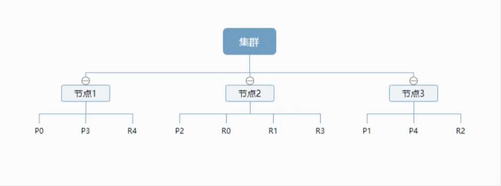

# ElasticSearch

## 概述

Elaticsearch ,简称为es，es是一个开源的**高扩展**的分布式**全文检索引擎**,它可以近乎**实时的存储**、**检索数据**;本身扩展性很好,可以扩展到上百台服务器,处理PB级别(大数据时代)的数据。es也使用Java开发并使用Lucene作为其核心来实现所有索引和搜索的功能,但是它的目的是通过简单的**RESTful API**来隐藏Lucene的复杂性,从而让全文搜索变得简单。

据国际权威的数据库产品评测机构DB Engines的统计,在2016年1月, ElasticSearch已超过Solr等,成为排名第一的搜索引擎类应用。

## 核心概念

**集群,节点,索引,类型,文档,分片,映射是什么? **

> elasticsearch是面向文档,关系型数据库和es的对比,一切都是

| Relational DB      | Elasticsearch   |
| ------------------ | --------------- |
| 数据库（database） | 索引（indices） |
| 表（tables）       | types           |
| 行（rows）         | documents       |
| 字段（columns）    | fields          |

**物理设计：**

elasticsearch在后台把每个**索引划分成多个分片**。每个分片可以在集群中的不同服务器间迁移

一个人就是一个集群

**逻辑设计：**

一个索引类型中，包含多个文档，当我们索引一篇文档时，可以通过这样的一个顺序找到它：索引->类型->文档id，通过这个组合我们就能索引到某个具体的文档。注意：**ID不必是整数，实际上它是一个字符串。**

> 文档

就是我们的一条条的记录

之前说elasticsearch是面向文档的,那么就意味着索弓和搜索数据的最小单位是文档, elasticsearch中,文档有几个重要属性:

自我包含, 一篇文档同时包含字段和对应的值,也就是同时包含key:value !
可以是层次型的，-一个文档中包含自文档,复杂的逻辑实体就是这么来的! {就是一 个json对象! fastjson进行自动转换!}
灵活的结构,文档不依赖预先定义的模式,我们知道关系型数据库中,要提前定义字段才能使用,在elasticsearch中,对于字段是非常灵活的,有时候,我们可以忽略该字段,或者动态的添加一个新的字段。
尽管我们可以随意的新增或者忽略某个字段,但是,每个字段的类型非常重要,比如一一个年龄字段类型,可以是字符串也可以是整形。因为elasticsearch会保存字段和类型之间的映射及其他的设置。这种映射具体到每个映射的每种类型,这也是为什么在elasticsearch中,类型有时候也称为映射类型。

> 类型

类型是文档的逻辑容器,就像关系型数据库一样,表格是行的容器。类型中对于字段的定 义称为映射,比如name映射为字符串类型。我们说文档是无模式的 ,它们不需要拥有映射中所定义的所有字段,比如新增一个字段,那么elasticsearch是怎么做的呢?elasticsearch会自动的将新字段加入映射,但是这个字段的不确定它是什么类型, elasticsearch就开始猜,如果这个值是18 ,那么elasticsearch会认为它是整形。但是elasticsearch也可能猜不对 ，所以最安全的方式就是提前定义好所需要的映射,这点跟关系型数据库殊途同归了,先定义好字段,然后再使用,别整什么幺蛾子。

> 索引

索引是映射类型的容器, elasticsearch中的索引是一个非常大的文档集合。索引存储了映射类型的字段和其他设置。然后它们被存储到了各个分片上了。



上图是一个有3个节点的集群,可以看到主分片和对应的复制分片都不会在同一个节点内,这样有利于某个节点挂掉了,数据也不至于丢失。实际上, 一个分片是-一个Lucene索引, 一个包含**倒排索引**的文件目录,倒排索引的结构使得elasticsearch在不扫描全部文档的情况下,就能告诉你哪些文档包含特定的关键字。

> 倒排索引

elasticsearch使用的是一种称为倒排索引 的结构,采用Lucene倒排索作为底层。这种结构适用于快速的全文搜索，一个索引由文
档中所有不重复的列表构成,对于每一个词,都有一个包含它的文档列表

```bash
Study every day， good good up to forever  # 文档1包含的内容
To forever, study every day，good good up  # 文档2包含的内容
```

为创建倒排索引,我们首先要将每个文档拆分成独立的词(或称为词条或者tokens) ,然后创建一个包含所有不重复的词条的排序列表,然后列出每个词条出现在哪个文档:

| term    | doc_1 | doc_2 |
| ------- | ----- | ----- |
| Study   | √     | x     |
| To      | x     | x     |
| every   | √     | √     |
| forever | √     | √     |
| day     | √     | √     |
| study   | x     | √     |
| good    | √     | √     |
| every   | √     | √     |
| to      | √     | x     |
| up      | √     | √     |

现在，我们试图搜索 to forever，只需要查看包含每个词条的文档

| term    | doc_1 | doc_2 |
| ------- | ----- | ----- |
| to      | √     | x     |
| forever | √     | √     |
| total   | 2     | 1     |

两个文档都匹配,但是第一个文档比第二个匹配程度更高。如果没有别的条件,现在,这两个包含关键字的文档都将返回。
再来看一个示例,比如我们通过博客标签来搜索博客文章。那么倒排索引列表就是这样的一个结构:

|                    |                    |                    |                    |
| ------------------ | ------------------ | ------------------ | ------------------ |
| 博客文章(原始数据) | 博客文章(原始数据) | 索引列表(倒排索引) | 索引列表(倒排索引) |
| 博客文章ID         | 标签               | 标签               | 博客文章ID         |
| 1                  | python             | python             | 1，2，3            |
| 2                  | python             | linux              | 3，4               |
| 3                  | linux，python      |                    |                    |
| 4                  | linux              |                    |                    |

如果要搜索含有python标签的文章,那相对于查找所有原始数据而言，查找倒排索引后的数据将会快的多。只需要查看标签这一栏,然后获取相关的文章ID即可。完全过滤掉无关的所有数据,提高效率!

**elasticsearch的索引和Lucene的索引对比**

在elasticsearch中，索引(库)这个词被频繁使用,这就是术语的使用。在elasticsearch中 ,索引被分为多个分片,每份分片是一个Lucene的索引。所以一个elasticsearch索引是由多 个Lucene索引组成的。

## IK分词器

分词:即把一段中文或者别的划分成一个个的关键字,我们在搜索时候会把自己的信息进行分词,会把数据库中或者索引库中的数据进行分词,然后进行一个匹配操作,默认的中文分词是将每个字看成一个词,如果要使用中文,建议使用ik分词器

IK提供了两个分词算法: **ik_ smart和ik_ max_ word** ,其中**ik_ smart**为最少切分, **ik_ max _word**为最细粒度划分

> 查看不同的分词效果

**ik_smart:最少切分**

```json
GET _analyze
{
  "analyzer": "ik_smart",
  "text": "中国共产党"
}
```

```json
{
  "tokens" : [
    {
      "token" : "中国共产党",
      "start_offset" : 0,
      "end_offset" : 5,
      "type" : "CN_WORD",
      "position" : 0
    }
  ]
}
```

**ik_max_word:最细粒度划分,穷尽词库的可能**

```json
GET _analyze
{
  "analyzer": "ik_max_word",
  "text": "中国共产党"
}
```

```json
{
  "tokens" : [
    {
      "token" : "中国共产党",
      "start_offset" : 0,
      "end_offset" : 5,
      "type" : "CN_WORD",
      "position" : 0
    },
    {
      "token" : "中国",
      "start_offset" : 0,
      "end_offset" : 2,
      "type" : "CN_WORD",
      "position" : 1
    },
    {
      "token" : "国共",
      "start_offset" : 1,
      "end_offset" : 3,
      "type" : "CN_WORD",
      "position" : 2
    },
    {
      "token" : "共产党",
      "start_offset" : 2,
      "end_offset" : 5,
      "type" : "CN_WORD",
      "position" : 3
    },
    {
      "token" : "共产",
      "start_offset" : 2,
      "end_offset" : 4,
      "type" : "CN_WORD",
      "position" : 4
    },
    {
      "token" : "党",
      "start_offset" : 4,
      "end_offset" : 5,
      "type" : "CN_CHAR",
      "position" : 5
    }
  ]
}
```

> 增加自己的配置

1. 增加自己的字典:mydic.dic

  ```
  马云
  马化腾
  ```

2. ik分词器配置文件:**IKAnalyzer.cfg.xml**

	```xml
	<?xml version="1.0" encoding="UTF-8"?>
	<!DOCTYPE properties SYSTEM "http://java.sun.com/dtd/properties.dtd">
	<properties>
		<comment>IK Analyzer 扩展配置</comment>
		<!--用户可以在这里配置自己的扩展字典 -->
		<entry key="ext_dict">mydic.dic</entry>
		 <!--用户可以在这里配置自己的扩展停止词字典-->
		<entry key="ext_stopwords"></entry>
		<!--用户可以在这里配置远程扩展字典 -->
		<!-- <entry key="remote_ext_dict">words_location</entry> -->
		<!--用户可以在这里配置远程扩展停止词字典-->
		<!-- <entry key="remote_ext_stopwords">words_location</entry> -->
	</properties>
	```

## Rest风格说明

一种软件架构风格，而不是标准。只是提供了一组设计原则和约束条件.它主要用于客户端和服务端交互类的软件,基于这个风格设计的软件可以更简介,更有层次, 更易于实现缓存等机制

| method | url地址                              | 描述               |
| ------ | ------------------------------------ | ------------------ |
| PUT    | localhost:9200/index/type/id         | 创建文档（指定id） |
| POST   | localhost:9200/index/type            | 创建文档（随机id） |
| POST   | localhost:9200/index/type/id/_update | 修改文档           |
| DELETE | localhost:9200/index/type/id         | 删除文档           |
| GET    | localhost:9200/index/type/id         | 通过id获取文档     |
| POST   | localhost:9200/index/type/_search    | 查询所有文档       |

## 关于索引的基本操作

> 增加索引

1. 创建一个索引

	```
	PUT /索引名/~类型名~/文档id
	{请求体}
	```

	```json
	PUT /test/type/1
	{
	  "name": "venns",
	  "age": "19"
	}
	```

	```json
	#! Deprecation: [types removal] Specifying types in document index requests is deprecated, use the typeless endpoints instead (/{index}/_doc/{id}, /{index}/_doc, or /{index}/_create/{id}).
	{
	  "_index" : "test", # 索引
	  "_type" : "type", # 类型
	  "_id" : "1", # id
	  "_version" : 1, # 版本
	  "result" : "created",# 状态
	  "_shards" : {
	    "total" : 2,
	    "successful" : 1,
	    "failed" : 0
	  },
	  "_seq_no" : 0,
	  "_primary_term" : 1
	}
	```

	完成了自动增加了索引,数据也成功的添加了

2. 基本类型
	- 字符串类型:text,keyword
	- 数值类型:long,integer,byte,doubel,float,half float,scaled float
	- 日期类型:date
	- 布尔值类型:boolean
	- 二进制类型:binary
	- ...

3. 指定字段的类型

	```json
	PUT /test2
	{
	  "mappings": {
	    "properties": {
	      "name": {
	        "type": "text"
	      },
	      "age": {
	        "type": "long"
	      },
	      "birthday": {
	        "type": "date"
	      }
	    }
	  }
	}
	```

4. 查看默认信息

	```
	GET 索引名 
	```

	如果自己文档字段没有指定,那么es就会给我们默认配置字段类型

扩展:

查看 elasticsearch 索引情况

```
GET _cat/health
```

查看健康状态

```
GET _cat/indices?v
```

等等,通过GET _cat/ 可以获得es的当前很多信息

> 修改索引

1. 使用PUT的命令进行覆盖

	```json
	PUT /test3/_doc/1
	{
	  "name": "venns1",
	  "age": "18",
	  "birthday": "2001-1-1"
	}
	```

	```json
	{
	  "_index" : "test3",
	  "_type" : "_doc",
	  "_id" : "1",
	  "_version" : 2,
	  "result" : "updated",
	  "_shards" : {
	    "total" : 2,
	    "successful" : 1,
	    "failed" : 0
	  },
	  "_seq_no" : 1,
	  "_primary_term" : 1
	}
	```

	可以看到,vesion已经变成了2

2. 使用POST命令进行更新

	```json
	POST /test3/_doc/1/_update
	{
	  "doc":{
	    "name": "venns2"
	  }
	}
	```

> 删除索引

```json
DELETE 索引名
```

通过delete命令实现删除,根据你的请求来判断删除索引还是删除文档记录

使用RESTFUL风格是ES推荐大家使用的

## 关于文档的基本操作

> 添加数据

```json
PUT /venns/user/1
{
  "name": "venns",
  "age": "19",
  "desc": "hello world",
  "tags": ["程序员","直男"]
} 
```

> 获取数据

```json
GET venns/user/1
```

> 更新数据

```json
POST venns/user/1/_update
{
  "doc":{
    "age": "20"
  }
} 
```

也可以使用PUT进行覆盖,需要将全部字段都写上,修改其中需要修改的字段,否则会为空

POST方式则可以只写需要修改的字段

> 简单的条件查询

```
GET venns/user/_search?q=desc:hello
```

可以根据映射规则,产生基本的查询

> 复杂查询

1. 使用json查询

    ```json
    GET venns/user/_search
    {
      "query": {
        "match": {
          "desc": "hello world"
        }
      }
    }
    ```

    查询的参数使用json构建

    hits:索引和文档信息,查询的结果总数,然后就是查询出来具体的文档,数据中的东西都可以遍历出来

    score:分数,可以理解为匹配度,可以通过分数来判断谁更加符合结果

2. 显示部分

	```json
	GET venns/user/_search
	{
	  "query": {
	    "match": {
	      "desc": "hello"
	    }
	  },
	  "_source": ["name","desc"]
	}
	```

	查询出来的结果只显示name和desc

3. 排序

	```json
	GET venns/user/_search
	{
	  "query": {
	    "match": {
	      "desc": "hello"
	    }
	  },
	  "sort": [
	    {
	      "age": {
	        "order": "asc"
	      }
	    }
	  ]
	}
	```

	按照age进行升序排序,如果order的值为desc,则为降序

4. 分页

	```json
	GET venns/user/_search
	{
	  "query": {
	    "match": {
	      "desc": "hello"
	    }
	  },
	  "from": 0,
	  "size": 1
	}
	```

	form:起始值 size:每页的数据量

5. 布尔值查询

	```json
	GET venns/user/_search
	{
	  "query": {
	    "bool": {
	      "must": [
	        {
	          "match": {
	            "desc": "hello"
	          }
	        },
	        {
	          "match": {
	            "age": "20"
	          }
	        }
	      ]
	    }
	  }
	}
	```

	must:所有的条件都要符合,类似于and

	```json
	GET venns/user/_search
	{
	  "query": {
	    "bool": {
	      "should": [
	        {
	          "match": {
	            "desc": "hello"
	          }
	        },
	        {
	          "match": {
	            "age": "20"
	          }
	        }
	      ]
	    }
	  }
	}
	```

	should:满足条件其一即可,类似于or

	```json
	GET venns/user/_search
	{
	  "query": {
	    "bool": {
	      "must_not": [
	        {
	          "match": {
	            "desc": "hello"
	          }
	        },
	        {
	          "match": {
	            "age": "20"
	          }
	        }
	      ]
	    }
	  }
	}
	```

	must_not:查询不满足条件的,类似于not

6. 过滤器

	```json
	GET venns/user/_search
	{
	  "query": {
	    "bool": {
	      "must": [
	        {
	          "match": {
	            "desc": "hello"
	          }
	        }
	      ],
	      "filter": {
	        "range": {
	          "age": {
	            "gte": 10,
	            "lte": 20
	          }
	        }
	      }
	    }
	  }
	}
	```

	可以使用filter进行数据过滤

	- gt 大于
	- gte 大于等于
	- lt 小于
	- lte 小于等于

7. 匹配多个条件

	```json
	GET venns/user/_search
	{
	  "query": {
	    "match": {
	      "tags": "男 程序"
	    }
	  }
	}
	```

	多个条件使用空格隔开,只要满足其一即可,可以按照分组进行判断

8. 精确查询

	- trem:直接查询精确的
	- match:会使用分词器解析(先分析文档,然后再通过分析的文档进行查询)

	- text类型会被分词器解析,keyword不会被分词器解析

## 集成SpringBoot

1. 新建springboot项目,导入elasticsearch依赖,保持和自己安装的版本一致.

	```xml
	<dependency>
	    <groupId>org.springframework.boot</groupId>
	    <artifactId>spring-boot-starter-data-elasticsearch</artifactId>
	</dependency>
	```

2. 编写配置类

	```java
	@Configuration
	public class ElasticSearchClientConfig {
	
	    @Bean
	    public RestHighLevelClient restHighLevelClient(){
	        RestHighLevelClient client = new RestHighLevelClient(
	                RestClient.builder(
	                        new HttpHost("localhost",9200,"http")
	                )
	        );
	        return client;
	    }
	}
	```

### 关于索引的api操作

### 关于文档的api操作

