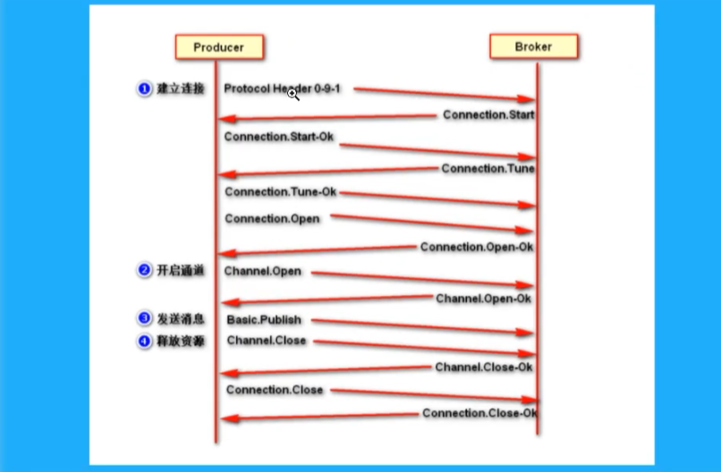
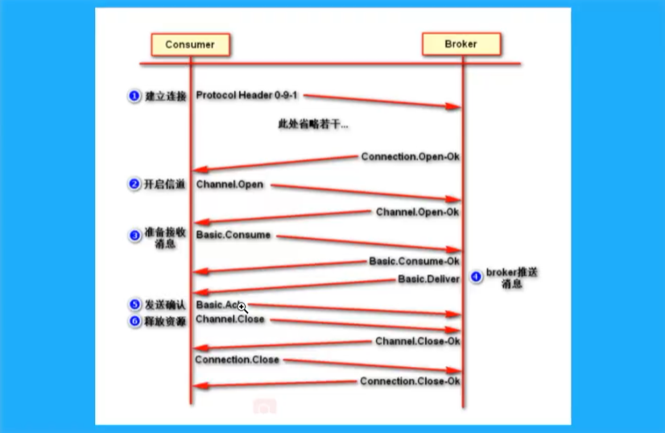
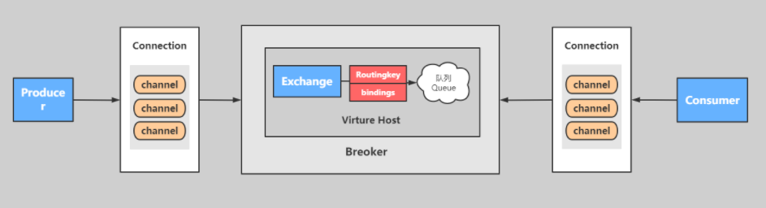
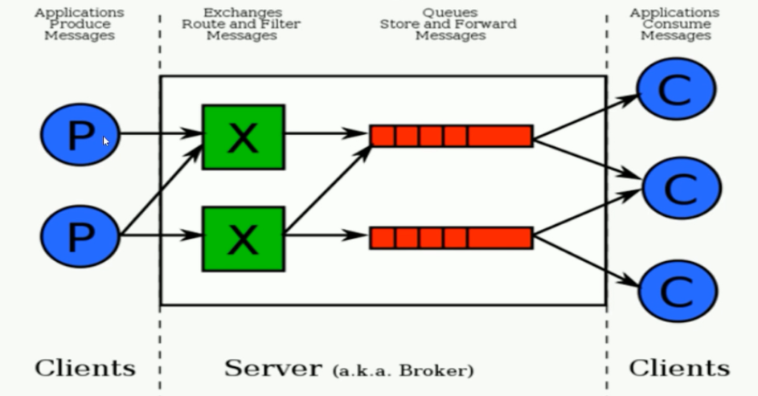
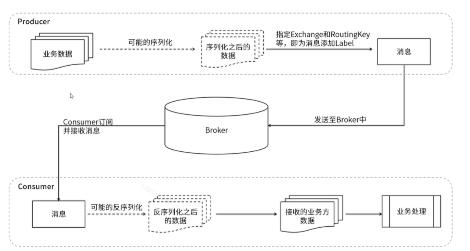
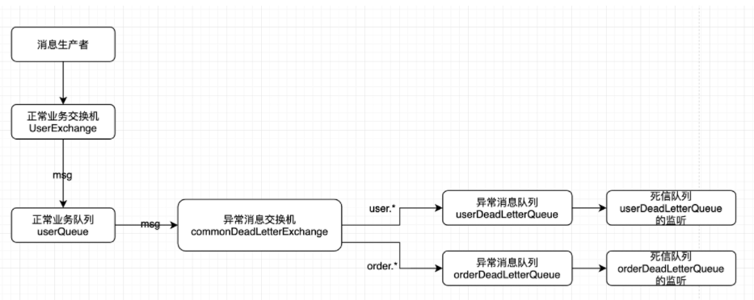
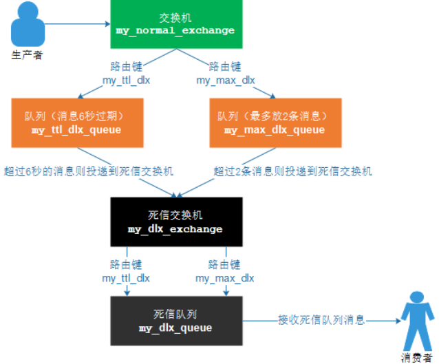

# RabbtiMQ

## 消息队列协议

### 什么是协议


我们知道消息中间件负责数据的传递，存储，和分发消费三个部分，数据的存储和分发的过程中肯定要遵循某种约定成俗的规范，你是采用底层的TCP/IP，UDP协议还是其他的自己去构建等，而这些约定成俗的规范就称之为：协议

> 所谓协议是指：
> 1：计算机底层操作系统和应用程序通讯时共同遵守的一组约定，只有遵循共同的约定和规范，系统和底层操作系统之间才能相互交流。
> 2：和一般的网络应用程序的不同它主要负责数据的接受和传递，所以性能比较的高。
> 3：协议对数据格式和计算机之间交换数据都必须严格遵守规范。

### 网络协议的三要素

1.语法。语法是用户数据与控制信息的结构与格式,以及数据出现的顺序。
2.语义。语义是解释控制信息每个部分的意义。它规定了需要发出何种控制信息,以及完成的动作与做出什么样的响应。
3.时序。时序是对事件发生顺序的详细说明。

比如我MQ发送一个信息，是以什么数据格式发送到队列中，然后每个部分的含义是什么，发送完毕以后的执行的动作，以及消费者消费消息的动作，消费完毕的响应结果和反馈是什么，然后按照对应的执行顺序进行处理，比如http协议：

> 1：语法：http规定了请求报文和响应报文的格式。
> 2：语义：客户端主动发起请求称之为请求。（这是一种定义，同时你发起的是post/get请求）
> 3：时序：一个请求对应一个响应。（一定先有请求在有响应，这个是时序）

而消息中间件采用的并不是http协议，而常见的消息中间件协议有：OpenWire、AMQP、MQTT、Kafka，OpenMessage协议。

**为什么消息中间件不直接使用http协议呢？**

>1: 因为http请求报文头和响应报文头是比较复杂的，包含了cookie，数据的加密解密，状态码，响应码等附加的功能，但是对于一个消息而言，我们并不需要这么复杂，也没有这个必要性，它其实就是负责数据传递，存储，分发就行，一定要追求的是高性能。尽量简洁，快速。
>2:大部分情况下http大部分都是短链接，在实际的交互过程中，一个请求到响应很有可能会中断，中断以后就不会就行持久化，就会造成请求的丢失。这样就不利于消息中间件的业务场景，因为消息中间件可能是一个长期的获取消息的过程，出现问题和故障要对数据或消息就行持久化等，目的是为了保证消息和数据的高可靠和稳健的运行。

### AMQP协议

AMQP：(全称：Advanced Message Queuing Protocol) 是高级消息队列协议。由摩根大通集团联合其他公司共同设计。是一个提供统一消息服务的应用层标准高级消息队列协议，是应用层协议的一个开放标准，为面向消息的中间件设计。基于此协议的客户端与消息中间件可传递消息，并不受客户端/中间件不同产品，不同的开发语言等条件的限制。Erlang中的实现有RabbitMQ等。
特性：

1. 分布式事务支持

2. 消息的持久化支持

3. 高性能和高可靠的消息处理优势

支持者：RabbtiMQ，ActiveMQ

### MQTT协议

MQTT协议：（Message Queueing Telemetry Transport）消息队列是IBM开放的一个即时通讯协议，物联网系统架构中的重要组成部分

特点：

1. 轻量

2. 结构简单

3. 传输快，不支持事务

4. 没有持久化设计。

应用场景:

1. 适用于计算能力有限

2. 低带宽

3. 网络不稳定的场景

支持者：RabbitMQ，ActiveMQ

### OpenMessage协议

是近几年由阿里、雅虎和滴滴出行、Stremalio等公司共同参与创立的分布式消息中间件、流处理等领域的应用开发标准

特点：

1. 结构简单
2. 解析速度快
3. 支持事务和持久化设计

支持者：Apache RocketMQ

### Kafka协议

Kafka协议是基于TCP/IP的二进制协议。消息内部是通过长度来分割，由一些基本数据类型组成

特点：

1. 结构简单
2. 解析速度快
3. 无事务支持
4. 有持久化设计

支持者：kafka

### 小结

协议：是在tcp/ip协议的基础之上构建的一种规定成俗的规范和机制，它的主要目的可以让客户端（应用程序，Java，python...）进行沟通和通讯，并且在这种协议下规范必须具有持久性，高可用，高可靠的性能。

## 角色分类

### none

- 不能访问management plugin

### management：查看自己相关节点的信息

- 列出自己可以通过AMQP登入的虚拟机
- 查看自己的虚拟机节点 virtual hosts的queues,exchanges和bindings信息
- 查看和关闭自己的channels和connections
- 查看有关自己的虚拟机节点virtual hosts的统计信息。包括其他用户在这个节点virtual hosts中的活动信息。

### Policymaker

- 包含management所有权限
- 查看和创建和删除自己的virtual hosts所属的policies和parameters信息

### Monitoring

- 包含management所有权限
- 罗列出所有的virtual hosts，包括不能登录的virtual hosts。
- 查看其他用户的connections和channels信息
- 查看节点级别的数据如clustering和memory使用情况
- 查看所有的virtual hosts的全局统计信息。

### Administrator

- 最高权限
- 可以创建和删除virtual hosts
- 可以查看，创建和删除users
- 查看创建permisssions
- 关闭所有用户的connections

## AMQP

### 什么是AMQP

AMQP全称：Advanced Message Queuing Protocol(高级消息队列协议)。是应用层协议的一个开发标准，为面向消息的中间件设计

### AMQP生产者流转过程



**为什么RabbitMQ采用channel处理消息而不是connection**

如果一个应用有多个线程需要从rabbitmq中消费消息或者生产消息，那么一定会建立多个connection，也就是多个tcp连接，对于操作系统而言，建立和销毁tcp连接是很昂贵的开销，因为其中会多次面临3次握手4次挥手，性能会下降，rabbitmq采用类似nio的做法，连接tcp连接复用（长连接），性能会得到提高。

### AMQP消费者流转过程



## RabbitMQ核心组成部分

### 核心组成部分



核心概念：
**Server：**又称Broker ,接受客户端的连接，实现AMQP实体服务。 安装rabbitmq-server
**Connection：**连接，应用程序与Broker的网络连接 TCP/IP/ 三次握手和四次挥手
**Channel：**网络信道，几乎所有的操作都在Channel中进行，Channel是进行消息读写的通道，客户端可以建立对各Channel，每个Channel代表一个会话任务。
**Message：** 消息：服务与应用程序之间传送的数据，由Properties和body组成，Properties可是对消息进行修饰，比如消息的优先级，延迟等高级特性，Body则就是消息体的内容。
**Virtual Host：** 虚拟地址，用于进行逻辑隔离，最上层的消息路由，一个虚拟主机理由可以有若干个Exhange和Queueu，同一个虚拟主机里面不能有相同名字的Exchange
**Exchange：**交换机，接受消息，根据路由键发送消息到绑定的队列。(不具备消息存储的能力)
**Bindings：**Exchange和Queue之间的虚拟连接，binding中可以保护多个routing key.
**Routing key：**是一个路由规则，虚拟机可以用它来确定如何路由一个特定消息。
**Queue：**队列，也称为Message Queue,消息队列，保存消息并将它们转发给消费者

### 整体架构



### 运行流程

   

## 队列模式

### 简单模式（simple）

> 一个生产者，一个消费者，消息通过FIFO模式排队

生产者：

```java
public class Producer {
    public static void main(String[] args) {
        // 所有的中间件技术都是基于tcp/ip 协议之上构建的新型协议规范，rabbitmq 遵循的是amqp
        // ip port

        // 1. 创建连接工厂
        ConnectionFactory connectionFactory = new ConnectionFactory();
        connectionFactory.setHost("localhost"); // 主机号
        connectionFactory.setPort(5672); // 端口号
        connectionFactory.setUsername("admin"); // 账号名
        connectionFactory.setPassword("admin"); // 密码
        connectionFactory.setVirtualHost("/"); // 访问节点
        // 2. 创建连接
        Connection connection = null;
        Channel channel = null;
        try {
            connection = connectionFactory.newConnection("生产者");
            // 3. 通过连接获取通道
            channel = connection.createChannel();
            // 4. 通过通道创建交换机 声明队列 绑定关系 路由key 发送消息 接收消息
            String queueName = "queue1";
            /**
             * @Params1 队列名
             * @Params2 是否持久化
             * @Params3 排他性，是否是一个独占队列
             * @Params4 是否自动删除，最后一个消费者消费完毕消息 是否把队列自动删除
             * @Params5 携带附属参数
             */
            channel.queueDeclare(queueName,false,false,false,null);
            // 5. 准备消息内容
            String message = "Hello World!";
            // 6. 发送消息给队列queue
            /**
             * @Params1 交换机 虽然没有指定交换机，但是一定会存在一个默认的交换机
             * @Params2 队列，路由key
             * @Params3 消息的状态控制
             * @Params4 消息主体
             */
            channel.basicPublish("",queueName,null,message.getBytes(StandardCharsets.UTF_8));
            System.out.println("消息发送成功!");
        } catch (IOException e) {
            e.printStackTrace();
        } catch (TimeoutException e) {
            e.printStackTrace();
        }finally {
            // 7. 关闭连接
            if (channel != null && channel.isOpen()){
                try {
                    channel.close();
                } catch (IOException e) {
                    e.printStackTrace();
                } catch (TimeoutException e) {
                    e.printStackTrace();
                }
            }
            // 8. 关闭通道
            if (connection != null && connection.isOpen()){
                try {
                    connection.close();
                } catch (IOException e) {
                    e.printStackTrace();
                }
            }

        }
    }
}
```

消费者：

```java
public class Consumer {
    public static void main(String[] args) {
        // 1. 创建连接工厂
        ConnectionFactory connectionFactory = new ConnectionFactory();
        connectionFactory.setHost("localhost"); // 主机号
        connectionFactory.setPort(5672); // 端口号
        connectionFactory.setUsername("admin"); // 账号名
        connectionFactory.setPassword("admin"); // 密码
        connectionFactory.setVirtualHost("/"); // 访问节点
        // 2. 创建连接
        Connection connection = null;
        Channel channel = null;
        try {
            connection = connectionFactory.newConnection("消费者");
            // 3. 通过连接获取通道
            channel = connection.createChannel();
            // 4. 通过通道创建交换机 声明队列 绑定关系 路由key 发送消息 接收消息
            String queueName = "queue1";
            /**
             * @Params1 队列名
             * @Params2 是否持久化
             * @Params3 排他性，是否是一个独占队列
             * @Params4 是否自动删除，最后一个消费者消费完毕消息 是否把队列自动删除
             * @Params5 携带附属参数
             */
            channel.queueDeclare(queueName,false,false,false,null);
            // 5. 接收消息
            channel.basicConsume("queue", true, new DeliverCallback() {
                @Override
                public void handle(String s, Delivery delivery) throws IOException {
                    System.out.println("收到的消息是-> " + new String(delivery.getBody(), "UTF-8"));
                }
            }, new CancelCallback() {
                @Override
                public void handle(String s) throws IOException {
                    System.out.println("消息接收失败");
                }
            });

        } catch (IOException e) {
            e.printStackTrace();
        } catch (TimeoutException e) {
            e.printStackTrace();
        }finally {
            // 6. 关闭连接
            if (channel != null && channel.isOpen()){
                try {
                    channel.close();
                } catch (IOException e) {
                    e.printStackTrace();
                } catch (TimeoutException e) {
                    e.printStackTrace();
                }
            }
            // 7. 关闭通道
            if (connection != null && connection.isOpen()){
                try {
                    connection.close();
                } catch (IOException e) {
                    e.printStackTrace();
                }
            }

        }
    }
}
```

### 发布订阅模式（fanout）

>  一个生产者，一个交换机，多个队列，多个消费者，一个消息经过队列后只能被一个消费者获取，所以每个消费者都配备了队列
>
>  生产者生成消息后，将由交换机分发到多个队列，队列再将消息传递给后方的消费者。一个消息可以被分发给多个消息队列，所以可以达到一个消息被多个消费者消费的目的。

生产者：

```java
public class Producer {
    public static void main(String[] args) {
        // 1: 创建连接工厂
        ConnectionFactory connectionFactory = new ConnectionFactory();
        // 2: 设置连接属性
        connectionFactory.setHost("localhost");
        connectionFactory.setPort(5672);
        connectionFactory.setVirtualHost("/");
        connectionFactory.setUsername("admin");
        connectionFactory.setPassword("admin");
        Connection connection = null;
        Channel channel = null;
        try {
            // 3: 从连接工厂中获取连接
            connection = connectionFactory.newConnection("生产者");
            // 4: 从连接中获取通道channel
            channel = connection.createChannel();
            // 6： 准备发送消息的内容
            String message = "hello world";
            // 指定交换机
            String  exchangeName = "fanout-exchange";
            // 定义路由key
            String routingKey = "";
            // 指定交换机的类型
            String type = "fanout";
            // 7: 发送消息给中间件rabbitmq-server
            // @params1: 交换机exchange
            // @params2: 队列名称/routingkey
            // @params3: 属性配置
            // @params4: 发送消息的内容
            channel.basicPublish(exchangeName, routingKey, null, message.getBytes());
            System.out.println("消息发送成功!");
        } catch (Exception ex) {
            ex.printStackTrace();
            System.out.println("发送消息出现异常...");
        } finally {
            // 7: 释放连接关闭通道
            if (channel != null && channel.isOpen()) {
                try {
                    channel.close();
                } catch (Exception ex) {
                    ex.printStackTrace();
                }
            }
            if (connection != null) {
                try {
                    connection.close();
                } catch (Exception ex) {
                    ex.printStackTrace();
                }
            }
        }
    }
}
```

消费者：

```java
public class Consumer {
    private static Runnable runnable = () -> {
        // 1: 创建连接工厂
        ConnectionFactory connectionFactory = new ConnectionFactory();
        // 2: 设置连接属性
        connectionFactory.setHost("47.104.141.27");
        connectionFactory.setPort(5672);
        connectionFactory.setVirtualHost("/");
        connectionFactory.setUsername("admin");
        connectionFactory.setPassword("admin");
        //获取队列的名称
        final String queueName = Thread.currentThread().getName();
        Connection connection = null;
        Channel channel = null;
        try {
            // 3: 从连接工厂中获取连接
            connection = connectionFactory.newConnection("消费者");
            // 4: 从连接中获取通道channel
            channel = connection.createChannel();
            // 5: 申明队列queue存储消息
            /*
             *  如果队列不存在，则会创建
             *  Rabbitmq不允许创建两个相同的队列名称，否则会报错。
             *
             *  @params1： queue 队列的名称
             *  @params2： durable 队列是否持久化
             *  @params3： exclusive 是否排他，即是否私有的，如果为true,会对当前队列加锁，其他的通道不能访问，并且连接自动关闭
             *  @params4： autoDelete 是否自动删除，当最后一个消费者断开连接之后是否自动删除消息。
             *  @params5： arguments 可以设置队列附加参数，设置队列的有效期，消息的最大长度，队列的消息生命周期等等。
             * */
            // 这里如果queue已经被创建过一次了，可以不需要定义
            //channel.queueDeclare(queueName, false, false, false, null);
            // 6： 定义接受消息的回调
            Channel finalChannel = channel;
            finalChannel.basicConsume(queueName, true, new DeliverCallback() {
                @Override
                public void handle(String s, Delivery delivery) throws IOException {
                    System.out.println(queueName + "：收到消息是：" + new String(delivery.getBody(), "UTF-8"));
                }
            }, new CancelCallback() {
                @Override
                public void handle(String s) throws IOException {
                }
            });
            System.out.println(queueName + "：开始接受消息");
            System.in.read();
        } catch (Exception ex) {
            ex.printStackTrace();
            System.out.println("发送消息出现异常...");
        } finally {
            // 7: 释放连接关闭通道
            if (channel != null && channel.isOpen()) {
                try {
                    channel.close();
                } catch (Exception ex) {
                    ex.printStackTrace();
                }
            }
            if (connection != null && connection.isOpen()) {
                try {
                    connection.close();
                } catch (Exception ex) {
                    ex.printStackTrace();
                }
            }
        }
    };
    public static void main(String[] args) {
        // 启动三个线程去执行
        new Thread(runnable, "queue-1").start();
        new Thread(runnable, "queue-2").start();
        new Thread(runnable, "queue-3").start();
    }
}
```

- 使用多线程模拟，这样生产者发布一次消息，三个消费者都会接收到

- 也可以使用程序自己声明交换机和队列

	```java
	channel.exchangeDeclare(exchangeName,exchangeType,true);
	// 交换机名字 交换机类型 是否持久化
	channel.queueDeclare(queueName,true,false,false,null);
	// 队列名字 是否持久化 是否具有排他性 是否自动删除 参数
	channel.queueBind(queueName,exchangeName,routingKey);
	// 绑定队列和交换机的关系 队列名 交换机名 routingkey
	```

### 路由模式（direct）

>  一个生产者，一个交换机，多个队列，多个消费者；与订阅模式类似，不同之处在于消息带有类型，不同的消费者可以订阅不同类型的消息；（消息可以自定义类型，例如“update”、“create”、“delete”、“audit.irs.corporate”等）
>
>  消息在经过交换机时，根据消息的类型进行路由，从而被分发到不同的队列中；

生产者：

```Java
public class Producer {
    public static void main(String[] args) {
        // 1: 创建连接工厂
        ConnectionFactory connectionFactory = new ConnectionFactory();
        // 2: 设置连接属性
        connectionFactory.setHost("localhost");
        connectionFactory.setPort(5672);
        connectionFactory.setVirtualHost("/");
        connectionFactory.setUsername("admin");
        connectionFactory.setPassword("admin");
        Connection connection = null;
        Channel channel = null;
        try {
            // 3: 从连接工厂中获取连接
            connection = connectionFactory.newConnection("生产者");
            // 4: 从连接中获取通道channel
            channel = connection.createChannel();
            // 6： 准备发送消息的内容
            String message = "hello world";
            // 指定交换机
            String  exchangeName = "direct-exchange";
            // 定义路由key
            String routingKey = "email";
            // 指定交换机的类型
            String type = "direct";
            // 7: 发送消息给中间件rabbitmq-server
            // @params1: 交换机exchange
            // @params2: 队列名称/routingkey
            // @params3: 属性配置
            // @params4: 发送消息的内容
            channel.basicPublish(exchangeName, routingKey, null, message.getBytes());
            System.out.println("消息发送成功!");
        } catch (Exception ex) {
            ex.printStackTrace();
            System.out.println("发送消息出现异常...");
        } finally {
            // 7: 释放连接关闭通道
            if (channel != null && channel.isOpen()) {
                try {
                    channel.close();
                } catch (Exception ex) {
                    ex.printStackTrace();
                }
            }
            if (connection != null) {
                try {
                    connection.close();
                } catch (Exception ex) {
                    ex.printStackTrace();
                }
            }
        }
    }
}
```

消费者同发布订阅模式，但是只有配置了指定路口key的queue1，queue2可以收到消息

### 主题模式（topic）

> 一个生产者，一个交换机，多个队列，多个消费者；与路由模式类似，不同之处在于，其可以通过简单通配符的方式进行消息路由，比如“#”表示所有消息类型，" * "表示单一词匹配；
>     例如：“audit.irs.corporate”消息，“audit.#”可以匹配到，但“audit.*”只能匹配“audit.irs”消息。

生产者：

```java
public class Producer {
    public static void main(String[] args) {
        // 1: 创建连接工厂
        ConnectionFactory connectionFactory = new ConnectionFactory();
        // 2: 设置连接属性
        connectionFactory.setHost("localhost");
        connectionFactory.setPort(5672);
        connectionFactory.setVirtualHost("/");
        connectionFactory.setUsername("admin");
        connectionFactory.setPassword("admin");
        Connection connection = null;
        Channel channel = null;
        try {
            // 3: 从连接工厂中获取连接
            connection = connectionFactory.newConnection("生产者");
            // 4: 从连接中获取通道channel
            channel = connection.createChannel();
            // 6： 准备发送消息的内容
            String message = "hello world";
            // 指定交换机
            String  exchangeName = "topic-exchange";
            // 定义路由key
            String routingKey = "com.order.test.xxx";
            // 指定交换机的类型
            String type = "topic";
            // 7: 发送消息给中间件rabbitmq-server
            // @params1: 交换机exchange
            // @params2: 队列名称/routingkey
            // @params3: 属性配置
            // @params4: 发送消息的内容
            channel.basicPublish(exchangeName, routingKey, null, message.getBytes());
            System.out.println("消息发送成功!");
        } catch (Exception ex) {
            ex.printStackTrace();
            System.out.println("发送消息出现异常...");
        } finally {
            // 7: 释放连接关闭通道
            if (channel != null && channel.isOpen()) {
                try {
                    channel.close();
                } catch (Exception ex) {
                    ex.printStackTrace();
                }
            }
            if (connection != null) {
                try {
                    connection.close();
                } catch (Exception ex) {
                    ex.printStackTrace();
                }
            }
        }
    }
}
```

例如，现在有四个队列，他们的routing key分别为：`com.#`,`*.course`,`#.order.#`,`#.user.*`，现在就只有队列1和队列3可以收到消息

### 工作模式（work）

工作模式主要有两种模式：

- 轮询分发：一个消费者一条，按均分配

- 公平分发：处理快的处理的多，处理慢的处理的少，按劳分配

#### 轮询模式

生产者：

```java
public class Producer {
    public static void main(String[] args) {
        // 1: 创建连接工厂
        ConnectionFactory connectionFactory = new ConnectionFactory();
        // 2: 设置连接属性
        connectionFactory.setHost("localhost");
        connectionFactory.setPort(5672);
        connectionFactory.setVirtualHost("/");
        connectionFactory.setUsername("admin");
        connectionFactory.setPassword("admin");
        Connection connection = null;
        Channel channel = null;
        try {
            // 3: 从连接工厂中获取连接
            connection = connectionFactory.newConnection("生产者");
            // 4: 从连接中获取通道channel
            channel = connection.createChannel();
            for (int i = 0; i <= 20; i++) {
                String msg = "hello world " + i;
                channel.basicPublish("","queue1",null,msg.getBytes());
            }
        } catch (Exception ex) {
            ex.printStackTrace();
            System.out.println("发送消息出现异常...");
        } finally {
            // 7: 释放连接关闭通道
            if (channel != null && channel.isOpen()) {
                try {
                    channel.close();
                } catch (Exception ex) {
                    ex.printStackTrace();
                }
            }
            if (connection != null) {
                try {
                    connection.close();
                } catch (Exception ex) {
                    ex.printStackTrace();
                }
            }
        }
    }
}

```

消费者：

```java
public class Consumer1 {
    public static void main(String[] args) {
        // 1. 创建连接工厂
        ConnectionFactory connectionFactory = new ConnectionFactory();
        connectionFactory.setHost("localhost"); // 主机号
        connectionFactory.setPort(5672); // 端口号
        connectionFactory.setUsername("admin"); // 账号名
        connectionFactory.setPassword("admin"); // 密码
        connectionFactory.setVirtualHost("/"); // 访问节点
        // 2. 创建连接
        Connection connection = null;
        Channel channel = null;
        try {
            connection = connectionFactory.newConnection("生产者");
            // 3. 通过连接获取通道
            channel = connection.createChannel();
            // 4. 通过通道创建交换机 声明队列 绑定关系 路由key 发送消息 接收消息
            String queueName = "queue1";
            /**
             * @Params1 队列名
             * @Params2 是否持久化
             * @Params3 排他性，是否是一个独占队列
             * @Params4 是否自动删除，最后一个消费者消费完毕消息 是否把队列自动删除
             * @Params5 携带附属参数
             */
            channel.queueDeclare(queueName,false,false,false,null);
            Channel finalChannel = channel;
            finalChannel.basicQos(1); // 指该消费者在接收到队列里的消息但没有返回确认结果之前,队列不会将新的消息分发给该消费者
            finalChannel.basicConsume("queue1", true, new DeliverCallback() {
                @Override
                public void handle(String s, Delivery delivery) throws IOException {
                    System.out.println("consumer1 收到的消息是-> " + new String(delivery.getBody(), "UTF-8"));
                }
            }, new CancelCallback() {
                @Override
                public void handle(String s) throws IOException {
                }
            });
            System.out.println("consumer1-开始接收消息");
            System.in.read();
        } catch (Exception e) {
            e.printStackTrace();
            System.out.println("消息发送出现异常");
        }finally {
            // 6. 关闭连接
            if (channel != null && channel.isOpen()){
                try {
                    channel.close();
                } catch (IOException e) {
                    e.printStackTrace();
                } catch (TimeoutException e) {
                    e.printStackTrace();
                }
            }
            // 7. 关闭通道
            if (connection != null && connection.isOpen()){
                try {
                    connection.close();
                } catch (IOException e) {
                    e.printStackTrace();
                }
            }

        }
    }
}

```

#### 公平分发

将普通消费者的应答方式改为手动应答

```java
// 将自动应答设为false 改为手动应答
finalChannel.basicConsume("queue1", false, new DeliverCallback() {
    @Override
    public void handle(String s, Delivery delivery) throws IOException {
        System.out.println("consumer1 收到的消息是-> " + new String(delivery.getBody(), "UTF-8"));
        try {
            // 收到一次消息睡眠1s
            Thread.sleep(1000);
            // 手动应答
            finalChannel.basicAck(delivery.getEnvelope().getDeliveryTag(), false);
        } catch (InterruptedException e) {
            e.printStackTrace();
        }
    }
}, new CancelCallback() {
    @Override
    public void handle(String s) throws IOException {
    }
});
```

再将另外的消费者收到一次消息的睡眠时长改为2s，体验不同处理能力的消费者处理不同数量的消息

 ## Springboot整合Rabbit

1. 新建springboot项目，导入rabbitmq依赖

	```xml
	<!-- rabbitmq 依赖-->
	<dependency>
	    <groupId>org.springframework.boot</groupId>
	    <artifactId>spring-boot-starter-amqp</artifactId>
	</dependency>
	```

2. 编写配置文件

	```yaml
	# rabbitmq配置
	spring:
	  rabbitmq:
	    username: admin # 默认guest
	    password: admin # guest
	    virtual-host: / # 默认 /
	    host: localhost # 默认localhost
	    port: 5672 # 默认5672
	```

### fonout发布订阅模式

用户下单，提供sms服务，短信服务和邮件服务。

**生产者：**

1. 

2. 编写交换机和队列的配置类

	```java
	@Configuration
	public class RabbitMqConfig {
	
	    // 1. 声明注册fanout模式的交换机
	    @Bean
	    public FanoutExchange fanoutExchange(){
	        return new FanoutExchange("fanout_order_exchange",true,false);// 交换机名称 是否持久化 是否自动删除
	    }
	    // 2. 声明队列 sms.fanout.queue email.fanout.queue message.fanout.queue
	    @Bean
	    public Queue smsQueue(){
	        return new Queue("sms.fanout.queue",true); // 队列名称 是否持久化
	    }
	    @Bean
	    public Queue emailQueue(){
	        return new Queue("email.fanout.queue",true); // 队列名称 是否持久化
	    }
	    @Bean
	    public Queue messageQueue(){
	        return new Queue("message.fanout.queue",true); // 队列名称 是否持久化
	    }
	    // 3. 完成绑定关系(队列和交换机)
	    @Bean
	    public Binding smsBinding(){
	        return BindingBuilder.bind(smsQueue()).to(fanoutExchange());
	    }
	    @Bean
	    public Binding emailBinding(){
	        return BindingBuilder.bind(emailQueue()).to(fanoutExchange());
	    }
	    @Bean
	    public Binding messageBinding(){
	        return BindingBuilder.bind(messageQueue()).to(fanoutExchange());
	    }
	
	}
	```

2. 编写订单业务

	```java
	@Service
	public class OrderService {
	
	    @Autowired
	    private RabbitTemplate rabbitTemplate;
	
	    /**
	     * @Description 模拟用户下单
	     * @param userId 用户id
	     * @param produceId 产品id
	     * @param num 数量
	     */
	    public void makeOrder(String userId,String produceId,int num){
	
	        // 1. 根据商品id查询库存是否充足
	        // 2. 保存订单
	        String orderId = UUID.randomUUID().toString();
	        System.out.println("订单生成成功:" + orderId);
	        // 3. 通过MQ来完成消息的分发
	        /**
	         * @param1 交换机
	         * @param2 路由key / 队列名称
	         * @param3 消息内容
	         */
	        String exchangeName = "fanout_order_exchange";
	        String routingKey = "";
	        rabbitTemplate.convertAndSend(exchangeName,routingKey,orderId);
	    }
	}
	```

3. 测试代码

	```java
	@SpringBootTest
	class SpringbootOrderRabbitmqProducerApplicationTests {
	
	    @Autowired
	    private OrderService orderService;
	
	    @Test
	    void contextLoads() {
	        orderService.makeOrder("1","1",10);
	    }
	
	}
	```

**消费者：**

1. 新建module，编写配置文件

	```yaml
	server:
	  port: 8081
	# rabbitmq配置
	spring:
	  rabbitmq:
	    username: admin # 默认guest
	    password: admin # guest
	    virtual-host: / # 默认 /
	    host: localhost # 默认localhost
	    port: 5672 # 默认5672
	```

2. 编写对应的服务

	```java
	@RabbitListener(queues = "email.fanout.queue")
	@Service
	public class EmailConsumer {
	    @RabbitHandler
	    public void reviceMessage(String message){
	        System.out.println("email fanout -- 接收到了订单信息是：" + message);
	    }
	}
	```

	```java
	@RabbitListener(queues = "message.fanout.queue")
	@Service
	public class MessageConsumer {
	
	    @RabbitHandler
	    public void reviceMessage(String message){
	        System.out.println("message fanout -- 接收到了订单信息是：" + message);
	    }
	}
	```

	```java
	@RabbitListener(queues = "sms.fanout.queue")
	@Service
	public class SMSConsumer {
	    @RabbitHandler
	    public void reviceMessage(String message){
	        System.out.println("sms fanout -- 接收到了订单信息是：" + message);
	    }
	}
	```

3. 启动生产者，再启动服务者，进行测试。

### direct路由模式

**生产者：**

1. 新建DirectRabbitMqConfig

	```java
	@Configuration
	public class DirectRabbitMqConfig {
	    // 1. 声明注册direct模式的交换机
	    @Bean
	    public DirectExchange directExchange(){
	        return new DirectExchange("direct_order_exchange",true,false);// 交换机名称 是否持久化 是否自动删除
	    }
	    // 2. 声明队列 sms.fanout.queue email.fanout.queue message.fanout.queue
	    @Bean
	    public Queue smsQueue(){
	        return new Queue("sms.direct.queue",true); // 队列名称 是否持久化
	    }
	    @Bean
	    public Queue emailQueue(){
	        return new Queue("email.direct.queue",true); // 队列名称 是否持久化
	    }
	    @Bean
	    public Queue messageQueue(){
	        return new Queue("message.direct.queue",true); // 队列名称 是否持久化
	    }
	    // 3. 完成绑定关系(队列和交换机)
	    @Bean
	    public Binding smsBinding(){
	        return BindingBuilder.bind(smsQueue()).to(directExchange()).with("sms");
	    }
	    @Bean
	    public Binding emailBinding(){
	        return BindingBuilder.bind(emailQueue()).to(directExchange()).with("email");
	    }
	    @Bean
	    public Binding messageBinding(){
	        return BindingBuilder.bind(messageQueue()).to(directExchange()).with("message");
	    }
	}
	```

2. 修改OrderService种的方法

	```java
	public void makeOrderDirect(String userId,String produceId,int num){
	
	    // 1. 根据商品id查询库存是否充足
	    // 2. 保存订单
	    String orderId = UUID.randomUUID().toString();
	    System.out.println("订单生成成功:" + orderId);
	    // 3. 通过MQ来完成消息的分发
	    /**
	     * @param1 交换机
	     * @param2 路由key / 队列名称
	     * @param3 消息内容
	     */
	    String exchangeName = "direct_order_exchange";
	    rabbitTemplate.convertAndSend(exchangeName,"message",orderId);
	    rabbitTemplate.convertAndSend(exchangeName,"email",orderId);
	}
	```

**消费者：**


1. 修改消费者中对应的服务

  ```java
  @RabbitListener(queues = "email.direct.queue")
  @Service
  public class EmailConsumer {
      @RabbitHandler
      public void reviceMessage(String message){
          System.out.println("email direct -- 接收到了订单信息是：" + message);
      }
  }
  ```

  ```java
  @RabbitListener(queues = "message.direct.queue")
  @Service
  public class MessageConsumer {
  
      @RabbitHandler
      public void reviceMessage(String message){
          System.out.println("message direct -- 接收到了订单信息是：" + message);
      }
  }
  ```

  ```java
  @RabbitListener(queues = "sms.direct.queue")
  @Service
  public class SMSConsumer {
      @RabbitHandler
      public void reviceMessage(String message){
          System.out.println("sms direct -- 接收到了订单信息是：" + message);
      }
  }
  ```

2. 启动生产者和消费者测试，就只有message服务和email服务会接收到订单信息

### topic主题模式

- 这里我们采用注解的方式

**生产者：**

OrderService新建使用topic模式的方法

```java
public void makeOrderTopic(String userId,String produceId,int num){

    // 1. 根据商品id查询库存是否充足
    // 2. 保存订单
    String orderId = UUID.randomUUID().toString();
    System.out.println("订单生成成功:" + orderId);
    // 3. 通过MQ来完成消息的分发
    /**
     * @param1 交换机
     * @param2 路由key / 队列名称
     * @param3 消息内容
     */
    String exchangeName = "topic_order_exchange";
    rabbitTemplate.convertAndSend(exchangeName,"cn.message",orderId);
    rabbitTemplate.convertAndSend(exchangeName,"email.com",orderId);
}
```

**消费者：**

```java
@RabbitListener(bindings = @QueueBinding(
        value = @Queue(value = "email.topic.queue",declare = "true",autoDelete = "false"),
        exchange = @Exchange(value = "topic_order_exchange",type = ExchangeTypes.TOPIC),
        key = "*.email.#"
))
@Service
public class EmailConsumer {
    @RabbitHandler
    public void reviceMessage(String message){
        System.out.println("email topic -- 接收到了订单信息是：" + message);
    }
}
```

```java
@RabbitListener(bindings = @QueueBinding(
        value = @Queue(value = "message.topic.queue",declare = "true",autoDelete = "false"),
        exchange = @Exchange(value = "topic_order_exchange",type = ExchangeTypes.TOPIC),
        key = "*.message.#"
))
@Service
public class MessageConsumer {

    @RabbitHandler
    public void reviceMessage(String message){
        System.out.println("message topic -- 接收到了订单信息是：" + message);
    }
}
```

```java
@RabbitListener(bindings = @QueueBinding(
        value = @Queue(value = "sms.topic.queue",declare = "true",autoDelete = "false"),
        exchange = @Exchange(value = "topic_order_exchange",type = ExchangeTypes.TOPIC),
        key = "sms.#"
))
@Service
public class SMSConsumer {
    @RabbitHandler
    public void reviceMessage(String message){
        System.out.println("sms topic -- 接收到了订单信息是：" + message);
    }
}
```

## TTL过期时间

过期时间TTL表示可以对消息设置预期的过期时间，在这个时间内都可以被消费者获取，过了之后消息将会被自动删除，RabbitMQ可以对**消息**和**队列**设置TTL，目前有两种办法可以设置。

- 第一种方法是通过队列属性设置，队列中所有消息都有相同的过期时间。
- 第二种方法是对消息进行单独设置，每条消息TTL可以不同。

如果上述两种方法同时使用，则消息的过期时间以两者之间TTL较小的那个数值为准。消息在队列的生存时间一旦超过设置的TTL值，就称为dead message被投递到死信队列， 消费者将无法再收到该消息。 

### 通过队列属性设置

```java
@Configuration
public class TTLRabbitMqConfig {

    // 1. 声明注册direct模式的交换机
    @Bean
    public DirectExchange ttldirectExchange(){
        return new DirectExchange("ttl_direct_order_exchange",true,false);
    }

    // 2. 设置队列过期时间
   	@Bean
    public Queue directTTLqueue(){
        Map<String,Object> args = new HashMap<>();
        args.put("x-message-ttl",5000); //设置过期时间
        return new Queue("ttl.direct.queue",true,false,false,args);
    }

    // 3. 将队列绑定到交换机
    @Bean
    public Binding directsmsBingding(){
        return BindingBuilder.bind(directTTLqueue()).to(ttldirectExchange()).with("ttl");
    }
}
```

- 这样，这个消息种的每条消息都会有一个过期时间为5000毫秒

### 单独给一条消息设置过期时间

```java
public void makeOrderTtlMessage(String userid,String produceId,int num){
    // 1. 根据商品id查询库存是否充足
    // 2. 保存订单
    String orderId = UUID.randomUUID().toString();
    System.out.println("订单生成成功:" + orderId);
    // 3. 通过MQ来完成消息的分发
    /**
     * @param1 交换机
     * @param2 路由key / 队列名称
     * @param3 消息内容
     */
    String exchangeName = "ttl_direct_exchange";
    String routingKey = "ttlmessage";

    // 给消息队列设置过期时间
    MessagePostProcessor messagePostProcessor = new MessagePostProcessor() {
        @Override
        public Message postProcessMessage(Message message) throws AmqpException {
            message.getMessageProperties().setExpiration("5000"); //设置过期时间
            message.getMessageProperties().setContentEncoding("UTF-8"); // 设置编码
            return message;
        }
    };
	rabbitTemplate.convertAndSend(exchangeName,routingKey,orderId,messagePostProcessor);
}
```

### 总结

- 具体使用哪种方式，以具体的场景来进行分析
- 如果同时设置设置了队列属性，又单独设置了一条消息的过期时间，则会按照最短的时间来。

## 死信队列

### 概述

DLX，全称为Dead-Letter-Exchange , 可以称之为死信交换机，也有人称之为死信邮箱。当消息在一个队列中变成死信(dead message)之后，它能被重新发送到另一个交换机中，这个交换机就是DLX ，绑定DLX的队列就称之为死信队列。
消息变成死信，可能是由于以下的原因：

- 消息被拒绝
- 消息过期
- 队列达到最大长度

DLX也是一个正常的交换机，和一般的交换机没有区别，它能在任何的队列上被指定，实际上就是设置某一个队列的属性。当这个队列中存在死信时，Rabbitmq就会自动地将这个消息重新发布到设置的DLX上去，进而被路由到另一个队列，即死信队列。
要想使用死信队列，只需要在定义队列的时候设置队列参数 `x-dead-letter-exchange` 指定交换机即可。



### 流程



### 简单应用

1. 注册一个死信交换机，绑定死信队列

	```java
	@Configuration
	public class DeadRabbitMqConfig {
	
	    // 1. 注册死信交换机 为direct模式
	    @Bean
	    public DirectExchange deadDirectExchange(){
	        return new DirectExchange("dead_direct_exchange",true,true);
	    }
	
	    // 2. 设置队列
	    @Bean
	    public Queue deadQueue(){
	        return new Queue("dead.direct.queue",true);
	    }
	
	    // 3. 交换机绑定队列
	    public Binding deadBinding(){
	        return BindingBuilder.bind(deadQueue()).to(deadDirectExchange()).with("dead");
	    }
	}
	```

2. 将设置有过期时间的队列绑定上死信交换机

	```java
	@Bean
	public Queue directTTLqueue(){
	    Map<String,Object> args = new HashMap<>();
	    args.put("x-message-ttl",5000); //设置过期时间
	    args.put("x-dead-letter-exchange","dead_direct_exchange"); //设置死信交换机
	    args.put("x-dead-letter-routing-key","dead"); // 因为死信交换机是direct模式，所以需要routingkey
	    return new Queue("ttl.direct.queue",true,false,false,args);
	}
	```

	