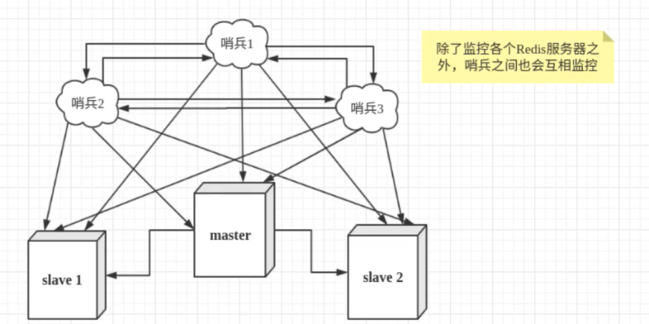
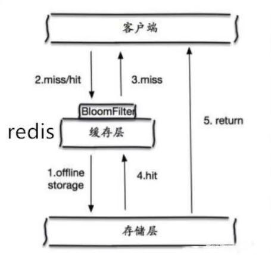
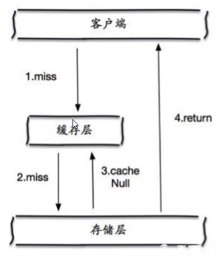

# Rdies简单入门

## 概述

> Redis是什么？

Redis(Remote Dictionary Server),即远程字典服务

是一个开源的，C语言编写，支持网络，可基于内存亦可持久化的日志型，Key-Value数据库，会周期性的把更新的数据写入磁盘或者把修改操作写入追加的记录文件，并提供多种语言的API，是当下最热门的NoSQL技术之一，也被人们称之为结构化数据库

> Redis能干嘛?

1. 内存存储，持久化（rdb，aof）
2. 效率高，可用于高速缓存
3. 发布订阅系统
4. 地图信息分析
5. 计时器，计数器
6. ......

> 特性

1. 多样的数据类型
2. 持久化
3. 集群
4. 事务
5. ......

## 基础命令

redis有16个数据库，默认使用第0个

> select [index]

切换数据库

> set [key] [value]

设置k-v键值对

> get [key]

获取key对应的value

>keys *

查看所有的键

> flushdb

清除当前数据库内容

> flushall

清除所有数据库内容

> EXISTS [key]

查看某个键是否存在

> move [key] [index] 

移动key到index数据库，如果index为本身，则在当前库移除key

> EXPIRE [key] [seconds]

设置key在second秒后过期

> ttl [key]

查看key剩余时间

> type [key]

查看key的数据类型

## 测试性能

**redis-benchmark**  压力测试工具

| 序号 | 选项      | 描述                                       | 默认值    |
| :--- | :-------- | :----------------------------------------- | :-------- |
| 1    | **-h**    | 指定服务器主机名                           | 127.0.0.1 |
| 2    | **-p**    | 指定服务器端口                             | 6379      |
| 3    | **-s**    | 指定服务器 socket                          |           |
| 4    | **-c**    | 指定并发连接数                             | 50        |
| 5    | **-n**    | 指定请求数                                 | 10000     |
| 6    | **-d**    | 以字节的形式指定 SET/GET 值的数据大小      | 2         |
| 7    | **-k**    | 1=keep alive 0=reconnect                   | 1         |
| 8    | **-r**    | SET/GET/INCR 使用随机 key, SADD 使用随机值 |           |
| 9    | **-P**    | 通过管道传输 <numreq> 请求                 | 1         |
| 10   | **-q**    | 强制退出 redis。仅显示 query/sec 值        |           |
| 11   | **--csv** | 以 CSV 格式输出                            |           |
| 12   | **-l**    | 生成循环，永久执行测试                     |           |
| 13   | **-t**    | 仅运行以逗号分隔的测试命令列表。           |           |
| 14   | **-I**    | Idle 模式。仅打开 N 个 idle 连接并等待。   |           |

简单测试100个并发连接，100000个请求

```bash
redis-benchmark -h loaclhost -p 6379 -c 100 -n 100000
```

## 五大数据类型

### String（字符串）

除了基本命令外，还支持以下命令：

#### 基本操作

> APPEND [key] [String]

将string追加到key对应的value，返回新字符串的长度

> STRLEN [key]

获取key对应的value字符串长度

> incr [key] 

将key对应的value自增1

> decr [key] 

将key对应的value自减1

> INCRBY [key]  [steps]

将key对应的value自增steps

> DECRBY [key]  [steps]

将key对应的value自减steps

> GETRANGE [key] [start] [end]

截取字符串，[start,end]为截取区间

> SETRANGE [key] [offset] [value]

字符串替换，offset为偏移量

> setex [key] [seconds] [value]

设置键值对，并设置过期时间

> setnx [key] [value]

如果不存在key，则设置，存在没变化

#### 批量处理

> mset [key] [value] ...

批量设置key-value

> mget [key]....

批量获取key

> msetnx [key] [value]

批量设置，如果不存在则设置，但，**msetnx是一个原子性操作，要么一起成功，要么一起失败**

#### 设置对象

> set user:1 {name:venns,age:18}

设置一个user:1 对象，值为json字符串，也可以用mset

> mest user:1:name venns user:1:age 18

#### 组合命令

>getset [key] [value]

获取key原来的value并设置新的value

### List（列表）

在reids里，可以把list当成双端队列，redis里所有list的操作命令，都以L开头

#### 基本命令

> LPUST/RPUSH  [key] [value]...

将一个或多个值从列表头部/尾部插入

> LRANGE [key] [start] [end]

从头部查看列表中start到end位置的值

> LPOP/RPOP [key] 

将左边/右边的值移出list

> lindex [key] [index]

通过下标获取list的值

> Llen [key]

返回列表的长度

#### 复杂命令

> lrem [key] [count] [value]

移除指定个数的值

> ltrim [key] [start] [end]

截取list指定位置的值，list只剩下截取的元素

> rpoplpush [source] [destination]

移除源列表的最后一个元素到目标列表

> lset [key] [index] [value]

替换列表中指定下标的值

> LINSERT [key]  [before]|[after] [pivot] [value]

在列表中将指定的值(value)插入到原来的值(pivot)的前面或后面

### Set（集合）

**无序不重复集合**

#### 基本命令

> sadd [key] [value]...

往集合中添加元素

> smembers [key]

查看集合中的元素

> sismember [key] [value]

判断集合中是否存在指定值

> scard [key]

查看集合中元素个数

> srem [key] [value]...

移除集合中的值

#### 复杂命令

> srandmember [key] [count]

随机获取集合中指定个数的元素

> spop [key] [count]

随机移除集合中指定个数的元素

> smove [source] [destination] [member]

将源集合中指定值移动到目标集合

> sdiff [key] [key]...

查看指定集合的查集（集合1存在，集合2不存在的元素）

> sinter [key] [key]...

查看指定集合的交集 （集合1和集合2共同存在的元素）

> sunion [key]  [key]..

查看指定集合的并集 （集合1和集合2存在的所有元素）

### Hash（哈希）

Map集合，本质和String 类型没有太大区别，还是一个简单key-value

#### 基本操作

> hset [key] [field] [value]

向指定集合添加K-V键值对

> hget [key] [field]

获取指定集合中指定键的值

> hdel [key] [filed..]

删除hash指定key，对应的valu也会被删除

> hlen [key]

查看hash中K-V键值对的个数

> hexists [key] [field]

判断hash中的指定字段是否存在

#### 批量操作

> hmset [key] [field] [value] [field value...]

批量设置键值对

> hget [key] [field...]

批量获取键对应的值

> hgetall [key]

获取hash中所有的键值对

> hkeys [key]

获取全部的key

> hvals [key]

获取全部的value

#### 其他命令

> hincrby [key] [key] [step]

将hash中的指定key自增指定step

> hsetnx [key] [filed] [value]

如果不存在则设置键值对

### Zset（有序集合）

#### 基本命令

> zadd [key] [NX|XX] [CH] [INCR] score member [score member ...] 

 往集合里添加数据

> zrange [key] [start] [value]

查看指定位置上的值

> zrangebyscore [score] [min] [max] [withscores]

按照符合指定区间的score排序，如果min为-inf（负无穷），max为+inf（正无穷）则排序所有,如果加 上withscores则显示score的值

> zrem [key]  [member...]

移除集合中指定的元素

> zcard [key]

获取集合中的元素个数

> zcount [key] [min] [max]

获取集合指定区间的元素个数

## 三种特殊数据类型

### Geospatial 地理位置

> geoadd [key] [longitude] [latitude] [member]

添加地理位置，格式为：集合名，纬度，经度，名字

> geopos [key] [member]

从集合中获取指定位置的经纬度

> geodist [key] [member1] [member2] [unit]

获取集合中指定两个位置的距离，unit为单位

> georadius [key] [longitude] [latitude] [radius] [unit] [withcoord] [withdist] count [number]

获取指定位置的指定半径内的所有元素

参数说明：

- withcoord：显示符合条件的经纬度
- withdist：显示距离
- count number：显示指定个数，如：count 1

> georadiusbymember [key] [member] [radius] [unit] [withcoord] [withdist] count [number]

获取集合中指定地点的的指定半径内的元素

> geohash [key] [member...]

获取指定地点的的11位字符的geohash字符串

### Hyperloglog

是一种数据结构， 用于做基数统计。

> pfadd [key] [element...]

往key里添加数据

> pfcount [key...]

统计key里数据个数

> pfmerge [destkey] [sourcekey...]

将sourcekey合并生成到destkey

### Bitmaps

位图，通过操作二进制来进行记录，就只有0和1两个状态

> setbit [key] [offset] [value]

设置指定键的指定位的值

> getbit [key] [offset]

获取指定键的指定位的值

> bitcount [key] [start] [end]

获取指定键的有效位个数，也可以指定区间

## 事务

**Redis单条命令是保持原子性的，但是事务不保持原子性**

**Redis事务本质：一组命令的集合，一组事务中的所有命令都会被序列化，在事务执行过程中，会按照顺序执行**

**Redis事务特性：一次性，顺序性，排他性**

**Redis事务没有隔离级别的概念：所有的命令在事务中，并没有直接被执行，只有在发起执行命令的时候才会执行**

**Redis的事务:**

- 开启事务（multi）
- 命令入队（...）
- 执行事务(exec)

> 正常执行事务

```bash
127.0.0.1:6379> multi # 开启事务
OK
# 命令入队 
127.0.0.1:6379> set k1 v1
QUEUED
127.0.0.1:6379> set k2 v2
QUEUED
127.0.0.1:6379> get k2
QUEUED
127.0.0.1:6379> exec # 执行事务
1) OK
2) OK
3) "v2"
```

> 放弃事务

```bash
127.0.0.1:6379> multi # 开启事务
OK
# 命令入队
127.0.0.1:6379> set k1 v2
QUEUED
127.0.0.1:6379> set k2 v2
QUEUED
127.0.0.1:6379> set k4 v4
QUEUED
127.0.0.1:6379> discard # 放弃事务，队列中所有命令都不会被执行
OK
```

> 编译型异常（代码有问题，命令有错），事务中所有的命令都不会被执行

```bash
127.0.0.1:6379> multi # 开启事务
OK
127.0.0.1:6379> set k1 v1
QUEUED
127.0.0.1:6379> set k2 v2
QUEUED
127.0.0.1:6379> set k3 v3
QUEUED
127.0.0.1:6379> getset k3 # 错误命令
(error) ERR wrong number of arguments for 'getset' command
127.0.0.1:6379> set k4 v4
QUEUED
127.0.0.1:6379> exec # 执行事务报错
(error) EXECABORT Transaction discarded because of previous errors.
127.0.0.1:6379> get k1 # 所有的命令都不会被执行
(nil)
```

> 运行时异常（代码运行时产生错误，逻辑错误），如果事务队列中存在语法性，那么执行命令的时候，其他命令时可以正常执行的，错误命令抛出异常

```bash
127.0.0.1:6379> set k1 "v1"
OK
127.0.0.1:6379> multi
OK
127.0.0.1:6379> incr k1 # 字符串自增1 逻辑错误
QUEUED
127.0.0.1:6379> set k2 v2
QUEUED
127.0.0.1:6379> get k2
QUEUED
127.0.0.1:6379> exec # 执行事务，虽然第一条命令失败了，但是其他命令成功了
1) (error) ERR value is not an integer or out of range
2) OK
3) "v2"
```

#### 监控 Watch

**悲观锁：**

- 认为什么时候都会出问题，无论做什么都会加锁

**乐观锁：**

- 认为什么时候都不会出问题，所以不会上锁，更新数据的时候取判断一下，在此期间是否有人修改过数据

- 获取version
- 更新的时候比较version

> Redis监控测试

正常执行成功：

```bash
127.0.0.1:6379> set money 100
OK
127.0.0.1:6379> set out 0
OK
127.0.0.1:6379> watch money # 监视money
OK
127.0.0.1:6379> multi # 事务正常结束，数据期间没有发送变动，这个时候就正常执行成功
OK
127.0.0.1:6379> decrby money 80
QUEUED
127.0.0.1:6379> incrby out 20
QUEUED
127.0.0.1:6379> exec
1) (integer) 20
2) (integer) 20
```

多进程模拟异常情况,使用watch当作redis的乐观锁操作：

1. 设置money（余额）为100，out（花费）为 0，为money开启监控，开始事务，out加10，money减10，但是不立即执行事务

	```bash
	127.0.0.1:6379> set money 100
	OK
	127.0.0.1:6379> set out 0
	OK
	127.0.0.1:6379> watch money
	OK
	127.0.0.1:6379> multi
	OK
	127.0.0.1:6379> decrby money 10
	QUEUED
	127.0.0.1:6379> incrby out 10
	QUEUED
	```

2. 开启另一个进程，模拟充值操作

	```bash
	127.0.0.1:6379> get money
	"100"
	127.0.0.1:6379> set money 1000
	OK
	```

3. 这时候再执行1步骤的事务，数据发生改变，事务执行失败

	```bash
	127.0.0.1:6379> exec # 对比监视的值是否发生变化，如果发生变化则执行失败，否则成功
	(error) EXECABORT Transaction discarded because of previous errors
	```

解决办法：

- 放弃监视后再重新监视，**但是事务执行后无论成功会失败都会自动解锁，所以只需要再次监视即可**

	```bash
	127.0.0.1:6379> unwatch
	OK
	127.0.0.1:6379> watch money
	OK
	```

## Jedis

> Redis官方推荐的Java连接开发工具，使用Java操作Redis的中间件，如果要使用Java操作Redis，一定要对Jedis熟悉

### 简单测试

1. 新建maven项目，导入对应依赖

	```xml
	<dependencies>
	        <dependency>
	            <groupId>redis.clients</groupId>
	            <artifactId>jedis</artifactId>
	            <version>3.3.0</version>
	        </dependency>
	        <dependency>
	            <groupId>com.alibaba</groupId>
	            <artifactId>fastjson</artifactId>
	            <version>1.2.74</version>
	        </dependency>
	</dependencies>
	```

2. 编码测试

	- 连接数据库
	- 操作命令，即Jedis对象.方法名()，方法名即为redis命令名。
	- 断开连接

	```java
	public class TestPing {
	    public static void main(String[] args) {
	
	        // 1.创建Jedis对象,连接服务器,需要先打开Redis服务,开放端口等等
	        Jedis jedis = new Jedis("127.0.0.1",6379);
	
	        // 2.测试连接
	        System.out.println(jedis.ping());
	
	        // 3. 关闭连接
	        jedis.close();
	    }
	}
	```

### 常用API

和Redis的命令同名，即Jedis对象.命令名()

### 事务操作

```java
public class TestTX {
    public static void main(String[] args) {

        // 1.连接Redis
        Jedis jedis = new Jedis("127.0.0.1",6379);

        // 2.创建命令
        jedis.flushDB();

        JSONObject jsonObject = new JSONObject();
        jsonObject.put("hello","world");
        jsonObject.put("name","venns");

        // 3.开启事务
        Transaction multi = jedis.multi();

        // 4.执行命令
        String result = jsonObject.toJSONString();
        //jedis.watch(result); //添加监控
        try {
            multi.set("user1",result);
            multi.set("user2",result);
            // int i = 1 / 0; //代码抛出异常，执行失败
            //如果成功则执行事务
            multi.exec();
        } catch (Exception e) {
            // 如果失败，则放弃事务
            multi.discard();
            e.printStackTrace();
        } finally {
            System.out.println(jedis.get("user1"));
            System.out.println(jedis.get("user2"));
            // 5.关闭连接
            jedis.close();
        }
    }
}
```

## SpringBoot整合Redis

在springboot2.x之后，原来使用的Jedis被替换成了lettuce

jedis：采用的是直连方式，多个线程操作的话，是不安全的，如果想要避免不安全，可以使用 jedis pool 连接池，更像BIO模式

lettuce：采用nettty，实例可以在多个线程中进行共享，不存在线程不安全的情况，可以减少线程数量，更像NIO模式

### 源码分析

```java
@ConditionalOnClass({RedisOperations.class})
@EnableConfigurationProperties({RedisProperties.class})
@Import({LettuceConnectionConfiguration.class, JedisConnectionConfiguration.class})
public class RedisAutoConfiguration {
    public RedisAutoConfiguration() {
    }

    //我们可以自己定义一个RedisTemplate来替换这个默认的
    @Bean
    @ConditionalOnMissingBean(
        name = {"redisTemplate"}
    )
    @ConditionalOnSingleCandidate(RedisConnectionFactory.class)
    public RedisTemplate<Object, Object> redisTemplate(RedisConnectionFactory redisConnectionFactory) {
        // 默认的RedisTemplate 没有过多的设置，redis 的对象都需要序列化
        // 两个泛型都是Object类型，我们后面使用需要强制转换<String,Object>
        RedisTemplate<Object, Object> template = new RedisTemplate();
        template.setConnectionFactory(redisConnectionFactory);
        return template;
    }

    // 由于String类型是Redis中最常用的类型，所以单独写了一个bean
    @Bean
    @ConditionalOnMissingBean
    @ConditionalOnSingleCandidate(RedisConnectionFactory.class)
    public StringRedisTemplate stringRedisTemplate(RedisConnectionFactory redisConnectionFactory) {
        StringRedisTemplate template = new StringRedisTemplate();
        template.setConnectionFactory(redisConnectionFactory);
        return template;
    }
}
```

### 整合测试

1. 导入依赖

	```xml
	<dependency>
	    <groupId>org.springframework.boot</groupId>
	    <artifactId>spring-boot-starter-data-redis</artifactId>
	</dependency>
	```

2. 配置连接

	```properties
	# 配置redis
	# 服务器默认就是localhost
	spring.redis.host=127.0.0.1 
	spring.redis.port=6379
	```

	如果需要配置连接池之类，推荐使用lettuce下的配置，因为jedis中有许多类未能注入成功。

3. 测试连接

	```java
	@SpringBootTest
	class RedisSpringbootApplicationTests {
	
	    @Autowired
	    private RedisTemplate redisTemplate;
	
	    @Test
	    void contextLoads() {
	
	        // RedisTemplate
	        /*
	            opsForValue 操作字符串，类似String
	            opsForList 操作list 类似List
	            opsForSet
	            opsFor...
	         */
	        // 除了基本的操作，我们常用的方法都可以直接通过redisTemplate操作，比如事务和基本的CRUD
	
	
	        // 获取Redis连接对象
	        RedisConnection connection = redisTemplate.getConnectionFactory().getConnection();
	        connection.flushDb();
	        connection.flushDb();
	
	        redisTemplate.opsForValue().set("name","venns");
	        System.out.println(redisTemplate.opsForValue().get("name"));
	    }
	
	}
	```

### 对象的序列化

RedisTemplate中的序列化设置:

```java
@Nullable
private RedisSerializer<?> defaultSerializer;
@Nullable
private ClassLoader classLoader;
@Nullable
private RedisSerializer keySerializer = null;
@Nullable
private RedisSerializer valueSerializer = null;
@Nullable
private RedisSerializer hashKeySerializer = null;
@Nullable
private RedisSerializer hashValueSerializer = null;
private RedisSerializer<String> stringSerializer = RedisSerializer.string();
```

```java
if (this.defaultSerializer == null) {
            this.defaultSerializer = new JdkSerializationRedisSerializer(this.classLoader != null ? this.classLoader : this.getClass().getClassLoader());
        }
```

可以看出：RedisTemplate默认序列化采用JDK序列化，我们可能需要JSON序列化，就需要自己写一个Redis的配置类-RedisConfig

```java
@Configurable
public class RedisConfig {

    // 编写我们自己的redisTemplate
    @Bean
    public RedisTemplate<String,Object> redisTemplate(RedisConnectionFactory redisConnectionFactory) throws UnknownHostException {
        // 为了开发方便，采用<String,Object>
        RedisTemplate<String, Object> template = new RedisTemplate<>();
        template.setConnectionFactory(redisConnectionFactory);

        // 配置具体的序列化方式
        // Json序列化配置
        Jackson2JsonRedisSerializer jackson2JsonRedisSerializer = new Jackson2JsonRedisSerializer<>(Object.class);
        ObjectMapper objectMapper = new ObjectMapper();
        objectMapper.setVisibility(PropertyAccessor.ALL, JsonAutoDetect.Visibility.ANY);
        objectMapper.activateDefaultTyping(LaissezFaireSubTypeValidator.instance);
        jackson2JsonRedisSerializer.setObjectMapper(objectMapper);

        // String 的序列化
        StringRedisSerializer stringRedisSerializer = new StringRedisSerializer();

        // key采用String的序列化
        template.setKeySerializer(stringRedisSerializer);

        // hash的key也采用String的序列化
        template.setHashKeySerializer(stringRedisSerializer);

        // value的序列化采用Jackson
        template.setValueSerializer(jackson2JsonRedisSerializer);

        // hash的value也采用Jackson
        template.setHashValueSerializer(jackson2JsonRedisSerializer);

        //使自定义序列化配置生效
        template.afterPropertiesSet();

        return template;
    }
}
```

## Redis.conf 详解

Redis启动的时候，就通过配置文件来启动

> 单位

```bash
# Note on units: when memory size is needed, it is possible to specify
# it in the usual form of 1k 5GB 4M and so forth:
#
# 1k => 1000 bytes
# 1kb => 1024 bytes
# 1m => 1000000 bytes
# 1mb => 1024*1024 bytes
# 1g => 1000000000 bytes
# 1gb => 1024*1024*1024 bytes
#
# units are case insensitive so 1GB 1Gb 1gB are all the same.

################################## INCLUDES ###################################
```

1. 配置文件对大小写不敏感

> 包含

```bash
# include .\path\to\local.conf
# include c:\path\to\other.conf
```

2. 可以包含其他的配置文件

> 网络

```bash
bind 127.0.0.1 # 绑定的ip
protected-mode yes # 开启保护模式
port 6379 # 端口配置
```

> 通用GENERAL

```bash
daemonize yes # 以守护进程的方式运行 默认是no 需要我们自己开启为yes
pidfile /var/run/redis.pid # 如果以后台的方式运行 我们需要指定一个pid进程文件

# 日志
# Specify the server verbosity level.
# This can be one of:
# debug (a lot of information, useful for development/testing)
# verbose (many rarely useful info, but not a mess like the debug level)
# notice (moderately verbose, what you want in production probably) # 生产环境使用
# warning (only very important / critical messages are logged)
loglevel notice
logfile "server_log.txt" # 日志文件的位置 如果为空就默认输出
databases 16 # 数据库的数量 默认16个数量
syslog-enabled yes # 是否显示启动logo
```

> 快照

主要用于持久化操作，Redis是内存数据库，如果没有持久化，那么数据断电即失

```bash
save 900 1 # 如果900秒内 至少有1个key进行了修改 就进行持久化操作
save 300 10 # 如果300秒内 至少有10个key进行了修改 就进行持久化操作
save 60 10000 # 如果60秒内 至少有一个key进行了修改 就进行持久化操作

stop-writes-on-bgsave-error yes # 持久化出错后 是否继续工作
rdbcompression yes # 是否压缩rdb文件 需要消耗一些cpu文件
rdbchecksum yes # 保存rdb文件的时候 进行错误的校验检查
dir ./ # rdb文件保存的目录
```

> REPLICATION 主从复制 后面详细讲解

> SECURITY 安全操作

可以在这里设置Redis密码，默认没有密码

```bash
127.0.0.1:6379> ping # 测试连接
PONG
127.0.0.1:6379> config get requirepass # 获取登录密码
1) "requirepass"
2) ""
127.0.0.1:6379> config set requirepass "123456" # 设置登录密码
OK
127.0.0.1:6379> config get requirepass # 获取密码
(error) NOAUTH Authentication required. # 提示权限不管
127.0.0.1:6379> auth 123456 # 使用密码登录
OK
127.0.0.1:6379> config get requirepass
1) "requirepass"
2) "123456"
```

> CLIENTS 限制

```bash
maxclients 10000 # 设置客户端最大连接数量
maxmemory <bytes> # redis配置的最大内存容量
maxmemory-policy noeviction # 内存上限处理策略
# 六大策略
# noeviction: 不删除策略, 达到最大内存限制时, 如果需要更多内存, 直接返回错误信息。（默认值）
# allkeys-lru: 所有key通用; 优先删除最近最少使用(less recently used ,LRU) 的 key。
# volatile-lru: 只限于设置了 expire 的部分; 优先删除最近最少使用(less recently used ,LRU) 的 key。
# allkeys-random: 所有key通用; 随机删除一部分 key。
# volatile-random: 只限于设置了 expire 的部分; 随机删除一部分 key。
# volatile-ttl: 只限于设置了 expire 的部分; 优先删除剩余时间(time to live,TTL) 短的key。
```

> APPEND NOLY 模式 aof配置

```bash
appendonly no # 默认不开启aof模式 默认采用rdb方式进行持久化
appendfilename "appendonly.aof" # 持久化的文件名

# appendfsync always # 每次修改都会 sync，消耗性能
appendfsync everysec # 每秒执行一次 sync（同步）可能会丢失这1秒的数据
# appendfsync no # 不执行 sync，操作系统自己同步数据，速度最快
```

## Redis持久化

Redis是内存数据库，如果不将内存中的数据库状态保存到磁盘，那么一旦服务器进程退出，服务器中的数据库状态也会消失，所以Redis提供了持久化功能

### RDB（Redis Database）

> 什么是RDB

在指定的时间间隔内将内存中的数据集快照写入磁盘，也就是Snapshot快照，它恢复时将快照文件直接读到内存里

Redis会单独创建一个子进程（fork）来进行持久化，会先将数据写入到一个临时文件中，待持久化过程都结束了，再用这个临时文件替换上次持久化好的文件，整个过程中，主进程是不进行任何IO操作的，这就确保了极高的性能，如果需要进行大规模数据的恢复，且对于数据恢复的完整性不是非常敏感，那RDB方式要比任何AOP方式更加的高效，RDB的缺点是最后一次持久化的数据可能丢失。

**Redis默认的持久化就是RDB，一般情况下不需要修改这个配置**

有时候在生产环境我们会将这个文件备份

**RDB保存的文件就是dump.rdb**，都可以在配置文件中进行配置

> 触发机制

1. save规则满足的情况下，会自动触发rdb规则
2. 执行fluashall命令，也会触发rdb规则
3. 退出redis，也会产生rdb文件

备份就自动生成一个dump.rdb文件

> 如何恢复rdb文件

1. 只需要将rdb文件放在我们的redis启动目录就可以了，redis启动的时候会自动检查dump.rdb文件

2. 查看我们需要存放的位置

	```bash
	127.0.0.1:6379> config get dir
	1) "dir"
	2) "/user/local/bin" # 如果在这个目录下存在dump.rdb文件。启动就会自动恢复其中的数据
	```

**Redis几乎自己的默认配置就够用了，但是我们还是需要去学习**

> rdb优缺点

优点：

1. 适合大规模的数据恢复
2. 如果对数据的完整性要求不太高

缺点：

1. 需要一定的时间间隔，如果redis意外宕机，那么最后一条修改的数据就没有了
2. fork一个进程的时候，会占用一定的内存空间

### AOF（Append Only File）

将我们所有的命令都记录下来，类似于有一个history文件，恢复的时候就将这个文件中的命令再执行一遍

> 什么是AOF

以日志的形式来记录每个写操作，将Redis执行过的所有指令记录下来（除了读的操作），只许追加文件但不可以改写文件，Redis启动之初会读取该文件重新构建数据，换言之，Redis重启的化就工具日志文件的内容将写指令从前到后执行一次以完成数据的恢复工作。

**AOF保存的是appendonly.aof文件**

> append

在配置文件中查看配置：

```bash
appendonlyno no # 默认是不开启的，我们需要手动进行配置 重启redis后生效
```

如果aof文件有错误，这时候redis是启动不起来的，我们需要进行修复，redis给我们提供了aof修复工具-**redis-check-aof**

```bash
redis-chek-aof --fix appendonly.aof
```

如果文件正常，重启就可以直接恢复

> 重写规则

aop默认就是文件的无限追加，文件会越来越大

配置文件中如下定义：

```bash
no-appendfsync-on-rewrite no # 是否开启重写机制
auto-aof-rewrite-percentage 100 # 重写占比
auto-aof-rewrite-min-size 64mb # 重写限制
```
如果aof文件大于64mb，就会fork一个新的进程进行重写

> aof优缺点

优点：

1. 每次修改都同步，文件的完整性会更好
2. 每秒同步一次，可能会丢失1秒的数据
3. 从不同步，效率最高

缺点：

1. 相对于数据文件来说，aof远远大于rdb，修复的速度也比rdb慢
2. aof运行效率也要比rdb慢，所以redis默认的配置是rdb持久化

### 扩展

1. RDB持久化方式能够在指定的时间间隔内对你的数据进行快照存储。
2. AOF 持久化方式记录每次对服务器写的操作，当服务器重启的时候会重新执行这些命令来恢复原始的数据,，AOF命令以Redis协议追加保存每次写的操作到文件末尾，Redis还能对AOF文件进行后台重写，使得AOF文件的体积不至于过大。
3. 只做缓存，如果你只希望你的数据在服务器运行的时候存在，你也可以不使用任何持久化
4. 同时开启两种持久化方式
	- 在这种情况下，当redis重启的时候会优先载入AOF文件来恢复原始的数据，因为在通常情况下AOF文件保存的数据集要比RDB文件保存的数据集要完整。
	- RDB的数据不实时，同时使用两者时服务器重启也只会找AOF文件，那要不要只使用AOF呢？作者建议不要，因为RDB更适合用于备份数据库( AOF在不断变化不好备份)，快速重启，而且不会有AOF可能潜在的Bug，留着作为一个万一的手段。
5. 性能建议
	- 因为RDB文件只用作后备用途，建议只在Slave上持久化RDB文件，而且只要15分钟备份一 次就够了，只保留 save 900 1 这条规则。
	- 如果Enable AOF，好处是在最恶劣情况下也只会丢失不超过两秒数据，启动脚本较简单只load自己的AOF文件就可以了，代价一是带来了持续的IO，二是AOF rewrite的最后将rewrite过程中产生的新数据写到新文件造成的阻塞几乎是不可避免的。只要硬盘许可，应该尽量减少AOF rewrite的频率，AOF重写的基础大小默认值64M太小了，可以设到5G以上，默认超过原大小100%大小重写可以改到适当的数值。
	- 如果不Enable AOF，仅靠Master-Slave Repllcation实现高可用性也可以，能省掉一大笔IO，也减少了rewrite时带来的系统波动。代价是如果Master/Slave 同时挂掉，会丢失 十几分钟的数据，启动脚本也要比较两个Master/Slave中的RDB文件，载入较新的那个，微博就是这种架构。

## Redis发布订阅

Redis发布订阅（pub/sub）是一种消息通信模式：发送者（pub）发送消息，订阅者（sub）接收消息

Redis客户端可以订阅任意数量的频道

订阅/发布消息步骤：

1. 消息发布者（redis cli）发布消息到队列（Redis server）
2. 多个消息订阅者（redis cli）接收队列的消息

角色划分：

1. 消息发送者
2. 频道
3. 消息订阅者

### 命令

> psubscribe [pattern...]

订阅一个或多个符合给定模式的频道

> pubsub subcommand [argument...]

查看订阅与发布系统的状态

> publish channel message

将消息发送到指定的频道

> punsubscribe [pattern...]

推定所有给定模式的频道

> subscribe [channel...]

订阅给定的一个或多个项目的频道消息

> unsubscribe [channel...]

推定给定的频道

### 原理

- Redis 是使用 C 实现的，通过分析 Redis 源码里的 pubsub.c 文件，可以了解发布和订阅机制的底层实现，以此加深对 Redis的理解。 Redis通过 PUBLISH、SUBSCRIBE 和 PSUBSCRIBE 等命令实现发布和订阅功能。

- 通过SUBSCRIBE 命令订阅某频道后，redis-server 里会维护一个字典，字典的键就是一个个 频道！而字典的值则是一个链表，链表中保存了所有订阅这个 channel 频道的客户端。SUBSCRIBE 命令的关键，就是将客户端添加到给定 channel 频道的订阅链表中。

- 通过 PUBLISH 命令向订阅者发送消息，redis-server 会使用给定的频道作为键，在他锁维护的 channel 字典中查找记录了订阅这个频道的所有客户端的链表，遍历这个链表，将消息发布给所有订阅者。
-  Pub/Sub 从字面上理解就是发布（Publish）与订阅（Subscribe） 在Redis中，你可以设定对某一个key值进行消息发布及消息订阅，当一个key值上进行了消息发布后，所有订阅它的客户端都会收到相应的消息。

## Redis主从复制

### 概念

主从复制，是指将一台Redis服务器的数据，复制到其他的Redis服务器。前者称为主节点(master)，后者称为从节点(slave)；数据的复制是单向的，只能由主节点到从节点。

**默认情况下，每台Redis服务器都是主节点；**且一个主节点可以有多个从节点(或没有从节点)，但一个从节点只能有一个主节点。

**主从复制的作用主要包括：**

1. 数据冗余：主从复制实现了数据的热备份，是持久化之外的一种数据冗余方式。
2. 故障恢复：当主节点出现问题时，可以由从节点提供服务，实现快速的故障恢复；实际上是一种服务的冗余。
3. 负载均衡：在主从复制的基础上，配合读写分离，可以由主节点提供写服务，由从节点提供读服务（即写Redis数据时应用连接主节点，读Redis数据时应用连接从节点），分担服务器负载；尤其是在写少读多的场景下，通过多个从节点分担读负载，可以大大提高Redis服务器的并发量。
4. 高可用基石：除了上述作用以外，主从复制还是哨兵和集群能够实施的基础，因此说主从复制是Redis高可用的基础。

一般来说，要将Redis运用于工程项目中，只使用一台Redis是万万不能的（宕机），原因如下：

1. 从结构上，单个Redis服务器会发生单点故障，并且一台服务器需要处理所有的请求负载，压力较 大；

2. 从容量上，单个Redis服务器内存容量有限，就算一台Redis服务器内存容量为256G，也不能将所有 内存用作Redis存储内存，一般来说，单台Redis大使用内存不应该超过20G。

### 环境配置

查看当前库的信息：

```bash
127.0.0.1:6379> info replication # 查看当前库的信息
# Replication
role:master # 角色
connected_slaves:0 # 从机数量
master_repl_offset:0 
repl_backlog_active:0
repl_backlog_size:1048576
repl_backlog_first_byte_offset:0
repl_backlog_histlen:0
```

复制3个配置文件修改对应的信息，伪集群搭建：

1. 端口
2. pid 名字
3. log文件名字
4. dump.rdb文件名

### 一主二从

**默认情况下，每台Redis服务器都是主节点**，我们一般情况下只用配置从机即可

```bash
slaveof host prot
```

将自己作为指定主机的从机（认大哥）

真实的主从配置应该在配置文件中配置，使用命令是暂时的。

> 细节

1. 主机可以写，从机只能读，主机中所有的信息和数据，都会被从机保存

2. 如果使用命令行进行主从配置，从机如果重启就又变回主机了，只要又变为从机，立马就会从主机中获取值

> 复制原理

Slave 启动成功连接到 master 后会发送一个sync同步命令

Master 接到命令，启动后台的存盘进程，同时收集所有接收到的用于修改数据集命令，在后台进程执行 完毕之后，**master将传送整个数据文件到slave，并完成一次完全同步。**

全量复制：而slave服务在接收到数据库文件数据后，将其存盘并加载到内存中。

增量复制：Master 继续将新的所有收集到的修改命令依次传给slave，完成同步 。

但是只要是重新连接master，一次完全同步（全量复制）将被自动执行， 我们的数据一定可以在从机中看到。

> 层层链路

举例：79端口的服务作为主节点，80端口的服务为79端口的从节点，81端口是80端口的从节点，这时候，80端口依旧是从节点。

> 主节点宕机后怎么办？

主节点宕机后，从节点没有主节点怎么办? 通过命令让自己当主节点

```bash
slaveof no one
```

这时候，自己就是主节点，其他的节点就可以手动连接到最新的这个主节点，如果这个时候老大修复了，那就重新连接

### 哨兵模式

自动选举老大的模式

> 概述

当主服务器宕机后，需要手动把一台从服务器切换为主服务器，这就需要人工干预，费事费力，还会造成一段时间内服务不可用。这不是一种推荐的方式，更多时候，我们优先考虑哨兵模式。Redis2.8开始正式提供了Sentinel（哨兵）架构来解决这个问题

谋朝篡位的自动版，能够后台监控主机是否故障，如果故障了根据投票数自动将库转换为主库（采取投票的模式）。

哨兵模式是一种特殊的模式，首先Redis提供了哨兵的命令，哨兵是一个独立的进程，作为进程，它会独立运行（也就是说我们要开启一个新的进程）。其原理是**哨兵通过发送命令，等待Redis服务器响应，从而监控运行的多个Redis实例（就是我给你不断地发送命令，你不回我了，你就是死了）**


这里的哨兵有两个作用：

- 通过发送命令，让Redis服务器返回监控其运行状态，包括主服务器和从服务器
- 当哨兵监控到mater宕机，会自动将slave切换成master，然后通过**发布订阅模式**通知其他从服务器，修改配置文件，让他们切换主机

然而一个哨兵进程对Redis服务器进行监控，可能会出现问题，为此，我们可以使用多个哨兵进行监控，各个哨兵之间还会进行监控，这样就形成了多哨兵模式



假设主服务器宕机，哨兵1先检测到这个结果，系统并不会马上进行failover过程，仅仅是哨兵1主观的认为主服务器不可用，这个现象成为**主观下线**。当后面的哨兵也检测到主服务器不可用，并且数量达到一定值时，那么哨兵之间就会进行一次投票，投票的结果由一个哨兵发起，进行failover[故障转移]操作。切换成功后，就会通过发布订阅模式，让各个哨兵把自己监控的从服务器实现切换主机，这个过程称为**客观下线**。

> 测试

目前的状态是1主2从

1. 配置哨兵的配置文件 sentinel.conf

	```bash
	sentinel monitor myredis 127.0.0.1 6379 1
	#sentinel monitor 被监控的名称 host port 1
	```

	数字1 为判断客观下线票数的临界点 代表主机宕机后，slave 投票选举主机，票数最多的，就会成为主机

2. 启动哨兵

	```bash
	redis-sentinel kconfig/sentinel.conf
	```

3. 如果Master节点断开了，这个时候就会从从机中随机选择一个服务器（这里有一个投票算法），可以从哨兵日志查看最新的主节点，如果原来的主机重新连接，只能归并到最新的主机下，当作从机

> 哨兵模式优缺点

优点：

1. 哨兵集群，基于主从复制，所有的主从配置，它全有
2. 主从可以切换，故障可以转移，系统的可用性就会更好
3. 哨兵模式就是主从模式的升级，手动到自动，更加健壮。

缺点：

1. Redis 不好在线扩容，集群容量一旦到达上限，在线扩容就十分麻烦
2. 实现哨兵模式的配置其实是很麻烦的，里面有很多选择

> 哨兵模式的全部配置

```bash
# Example sentinel.conf
  
# 哨兵sentinel实例运行的端口 默认26379，多个哨兵要配置多个哨兵端口，就是开启多个conf
port 26379
  
# 哨兵sentinel的工作目录
dir /tmp
  
# 哨兵sentinel监控的redis主节点的 ip port
# master-name  可以自己命名的主节点名字 只能由字母A-z、数字0-9 、这三个字符".-_"组成。
# quorum 当这些quorum个数sentinel哨兵认为master主节点失联 那么这时 客观上认为主节点失联了
# sentinel monitor <master-name> <ip> <redis-port> <quorum>
sentinel monitor mymaster 127.0.0.1 6379 1
  
# 当在Redis实例中开启了requirepass foobared 授权密码 这样所有连接Redis实例的客户端都要提供密码
# 设置哨兵sentinel 连接主从的密码 注意必须为主从设置一样的验证密码
# sentinel auth-pass <master-name> <password>
sentinel auth-pass mymaster MySUPER--secret-0123passw0rd
  
  
# 指定多少毫秒之后 主节点没有应答哨兵sentinel 此时 哨兵主观上认为主节点下线 默认30秒
# sentinel down-after-milliseconds <master-name> <milliseconds>
sentinel down-after-milliseconds mymaster 30000
  
# 这个配置项指定了在发生failover主备切换时最多可以有多少个slave同时对新的master进行 同步，
这个数字越小，完成failover所需的时间就越长，
但是如果这个数字越大，就意味着越 多的slave因为replication而不可用。
可以通过将这个值设为 1 来保证每次只有一个slave 处于不能处理命令请求的状态。
# sentinel parallel-syncs <master-name> <numslaves>
sentinel parallel-syncs mymaster 1
  
  
  
# 故障转移的超时时间 failover-timeout 可以用在以下这些方面：
#1. 同一个sentinel对同一个master两次failover之间的间隔时间。
#2. 当一个slave从一个错误的master那里同步数据开始计算时间。直到slave被纠正为向正确的master那里同步数据时。
#3.当想要取消一个正在进行的failover所需要的时间。 
#4.当进行failover时，配置所有slaves指向新的master所需的最大时间。不过，即使过了这个超时，slaves依然会被正确配置为指向master，但是就不按parallel-syncs所配置的规则来了
# 默认三分钟
# sentinel failover-timeout <master-name> <milliseconds>
sentinel failover-timeout mymaster 180000
  
# SCRIPTS EXECUTION
  
#配置当某一事件发生时所需要执行的脚本，可以通过脚本来通知管理员，例如当系统运行不正常时发邮件通知相关人员。
#对于脚本的运行结果有以下规则：
#若脚本执行后返回1，那么该脚本稍后将会被再次执行，重复次数目前默认为10
#若脚本执行后返回2，或者比2更高的一个返回值，脚本将不会重复执行。
#如果脚本在执行过程中由于收到系统中断信号被终止了，则同返回值为1时的行为相同。
#一个脚本的最大执行时间为60s，如果超过这个时间，脚本将会被一个SIGKILL信号终止，之后重新执行。
  
#通知型脚本:当sentinel有任何警告级别的事件发生时（比如说redis实例的主观失效和客观失效等等），将会去调用这个脚本，
#这时这个脚本应该通过邮件，SMS等方式去通知系统管理员关于系统不正常运行的信息。调用该脚本时，将传给脚本两个参数，
#一个是事件的类型，
#一个是事件的描述。
#如果sentinel.conf配置文件中配置了这个脚本路径，那么必须保证这个脚本存在于这个路径，并且是可执行的，否则sentinel无法正常启动成功。
#通知脚本
# sentinel notification-script <master-name> <script-path>
  sentinel notification-script mymaster /var/redis/notify.sh
  
# 客户端重新配置主节点参数脚本
# 当一个master由于failover而发生改变时，这个脚本将会被调用，通知相关的客户端关于master地址已经发生改变的信息。
# 以下参数将会在调用脚本时传给脚本:
# <master-name> <role> <state> <from-ip> <from-port> <to-ip> <to-port>
# 目前<state>总是“failover”,
# <role>是“leader”或者“observer”中的一个。
# 参数 from-ip, from-port, to-ip, to-port是用来和旧的master和新的master(即旧的slave)通信的
# 这个脚本应该是通用的，能被多次调用，不是针对性的。
# sentinel client-reconfig-script <master-name> <script-path>
sentinel client-reconfig-script mymaster /var/redis/reconfig.sh # Example sentinel.conf
  
# 哨兵sentinel实例运行的端口 默认26379，多个哨兵要配置多个哨兵端口，就是开启多个conf
port 26379
  
# 哨兵sentinel的工作目录
dir /tmp
  
# 哨兵sentinel监控的redis主节点的 ip port
# master-name  可以自己命名的主节点名字 只能由字母A-z、数字0-9 、这三个字符".-_"组成。
# quorum 当这些quorum个数sentinel哨兵认为master主节点失联 那么这时 客观上认为主节点失联了
# sentinel monitor <master-name> <ip> <redis-port> <quorum>
sentinel monitor mymaster 127.0.0.1 6379 1
  
# 当在Redis实例中开启了requirepass foobared 授权密码 这样所有连接Redis实例的客户端都要提供密码
# 设置哨兵sentinel 连接主从的密码 注意必须为主从设置一样的验证密码
# sentinel auth-pass <master-name> <password>
sentinel auth-pass mymaster MySUPER--secret-0123passw0rd

# 指定多少毫秒之后 主节点没有应答哨兵sentinel 此时 哨兵主观上认为主节点下线 默认30秒
# sentinel down-after-milliseconds <master-name> <milliseconds>
sentinel down-after-milliseconds mymaster 30000
  
# 这个配置项指定了在发生failover主备切换时最多可以有多少个slave同时对新的master进行 同步，
# 这个数字越小，完成failover所需的时间就越长，
# 但是如果这个数字越大，就意味着越 多的slave因为replication而不可用。
# 可以通过将这个值设为 1 来保证每次只有一个slave 处于不能处理命令请求的状态。
# sentinel parallel-syncs <master-name> <numslaves>
sentinel parallel-syncs mymaster 1

# 故障转移的超时时间 failover-timeout 可以用在以下这些方面：
#1. 同一个sentinel对同一个master两次failover之间的间隔时间。
#2. 当一个slave从一个错误的master那里同步数据开始计算时间。直到slave被纠正为向正确的master那里同步数据时。
#3.当想要取消一个正在进行的failover所需要的时间。 
#4.当进行failover时，配置所有slaves指向新的master所需的最大时间。不过，即使过了这个超时，slaves依然会被正确配置为指向master，但是就不按parallel-syncs所配置的规则来了
# 默认三分钟
# sentinel failover-timeout <master-name> <milliseconds>
sentinel failover-timeout mymaster 180000
  
# SCRIPTS EXECUTION
  
#配置当某一事件发生时所需要执行的脚本，可以通过脚本来通知管理员，例如当系统运行不正常时发邮件通知相关人员。
#对于脚本的运行结果有以下规则：
#若脚本执行后返回1，那么该脚本稍后将会被再次执行，重复次数目前默认为10
#若脚本执行后返回2，或者比2更高的一个返回值，脚本将不会重复执行。
#如果脚本在执行过程中由于收到系统中断信号被终止了，则同返回值为1时的行为相同。
#一个脚本的最大执行时间为60s，如果超过这个时间，脚本将会被一个SIGKILL信号终止，之后重新执行。
  
#通知型脚本:当sentinel有任何警告级别的事件发生时（比如说redis实例的主观失效和客观失效等等），将会去调用这个脚本，
#这时这个脚本应该通过邮件，SMS等方式去通知系统管理员关于系统不正常运行的信息。调用该脚本时，将传给脚本两个参数，
#一个是事件的类型，
#一个是事件的描述。
#如果sentinel.conf配置文件中配置了这个脚本路径，那么必须保证这个脚本存在于这个路径，并且是可执行的，否则sentinel无法正常启动成功。
#通知脚本
# sentinel notification-script <master-name> <script-path>
  sentinel notification-script mymaster /var/redis/notify.sh
  
# 客户端重新配置主节点参数脚本
# 当一个master由于failover而发生改变时，这个脚本将会被调用，通知相关的客户端关于master地址已经发生改变的信息。
# 以下参数将会在调用脚本时传给脚本:
# <master-name> <role> <state> <from-ip> <from-port> <to-ip> <to-port>
# 目前<state>总是“failover”,
# <role>是“leader”或者“observer”中的一个。
# 参数 from-ip, from-port, to-ip, to-port是用来和旧的master和新的master(即旧的slave)通信的
# 这个脚本应该是通用的，能被多次调用，不是针对性的。
# sentinel client-reconfig-script <master-name> <script-path>
sentinel client-reconfig-script mymaster /var/redis/reconfig.sh
```

## Redis缓存穿透和雪崩

Redis缓存的使用，极大的提升了应用程序的性能和效率，特别是数据查询方面。但同时，它也带来了一些问题，其中，最要害的问题，就是数据一致性的问题，从严格意义上讲，这个问题无解，如果对数据的一致性要求很高，那么就不能使用缓存。

另外一些经典问题就是，缓存穿透，缓存雪崩和缓存击穿，目前，业界也都有比较流行的解决方案。

### 缓存穿透（查不到）

> 概念

当用户想要查询一个数据，发现redis内存数据库没有，也就是缓存没有命中，于是向持久层数据库查询。发现也没有，于是本次查询失败。当用户很多的时候，缓存都没有命中（秒杀)，于是都去请求了持久层数据库。这会给持久层数据库造成很大的压力，这时候就相当于出现了缓存穿透。

> 解决方案

**布隆过滤器**

布隆过滤器是一种数据结构，对所有可能查询的参数以hash形式存储，在控制层先进行校验，不符合则丢弃，从而避免了对底层存储系统的查询压力。



**存储空对象**



但是这种方法会存在两个问题：

1. 如果空值能被缓存起来，这就意味着缓存需要更多的空间存储更多的键，因为这当中可能会有很多空值的键
2. 及时对空值设置了过期时间，还是会存在缓冲层和存储层的数据会有一段时间窗口的不一致，这对于需要保持一致性的业务会有影响

### 缓存击穿（量太大，缓存过期）

> 概述

这里需要注意和缓存击穿的区别，缓存击穿，是指一个key非常热点，在不停的扛着大并发，大并发集中对这一个点进行访问，当这个key在失效的瞬间，持续的大并发就穿破缓存，直接请求数据库，就像在一个屏障上凿开了一个洞。 

当某个key在过期的瞬间，有大量的请求并发访问，这类数据一般是热点数据，由于缓存过期，会同时访问数据库来查询最新数据，并且回写缓存，会导使数据库瞬间压力过大。

> 解决方案

**设置热点数据永不过期**

从缓冲层层面来看，没有设置过期时间，所以不会出现热点key过期后产生的问题

**加互斥锁**

分布式锁：使用分布式锁，保证对于每个key同时只有一个线程去查询后端服务，其他线程没有获得分布式锁的权限，因此只需要等待即可，这种方式将高并发的压力转移到了分布式锁，因此对分布式锁的考验很大。

### 缓存雪崩

> 概念

缓存雪崩，是指在某一个时间段，缓存集中过期失效。Redis宕机 产生雪崩的原因之一，比如在写本文的时候，马上就要到双十二零点，很快就会迎来一波抢购，这波商品时间比较集中的放入了缓存，假设缓存一个小时。那么到了凌晨一点钟的时候，这批商品的缓存就都过期了。而对这批商品的访问查询，都落到了数据库上，对于数据库而言，就会产生周期性的压力波峰。于是所有的请求都会达到存储层，存储层的调用量会暴增，造成存储层也会挂掉的情况。

> 解决方案 

**Redis高可用**

这个思想的含义是，既然redis有可能挂掉，那我多增设几台redis，这样一台挂掉之后其他的还可以继续工作，其实就是搭建的集群。(异地多活）

**限流降级**

这个解决方案的思想是，在缓存失效后，通过加锁或者队列来控制读数据库写缓存的线程数量。比如对某个key只允许一个线程查询数据和写缓存，其他线程等待。

**数据预热**

数据加热的含义就是在正式部署之前，我先把可能的数据先预先访问一遍，这样部分可能大量访问的数据就会加载到缓存中。在即将发生大并发访问前手动触发加载缓存不同的key，设置不同的过期时间，让缓存失效的时间点尽量均匀