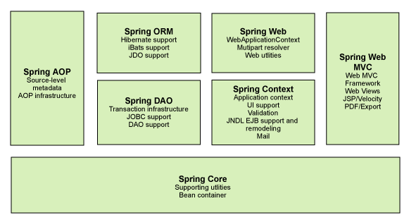

# 1.Spring

## 简介

- 2002，首次推出Spring框架的雏形：interface21
- 理念：是现有的技术更加任意使用，本身是一个大杂烩，整合了现有的技术框架
- SSH：Struct2 + Spring + Hibernate
- SSM：SpringMVC + Spring + Mybatis

```xml
<!-- https://mvnrepository.com/artifact/org.springframework/spring-webmvc -->
<dependency>
    <groupId>org.springframework</groupId>
    <artifactId>spring-webmvc</artifactId>
    <version>5.3.0</version>
</dependency>
<!-- https://mvnrepository.com/artifact/org.springframework/spring-jdbc -->
<dependency>
    <groupId>org.springframework</groupId>
    <artifactId>spring-jdbc</artifactId>
    <version>5.3.0</version>
</dependency>
```

## 优点

- Spring是一个开源的免费的框架
- 是一个轻量级的，非入侵式的框架
- 控制反转（IOC），面向切面编程（AOP）
- 支持事务的处理，对框架整合的支持

**总结：Spring就是一个轻量级的控制反转（IOC）和面向切面编程（AOP）的框架**

## 组成



## 扩展

- Spring Boot
	- 一个快速开发的脚手架
	- 基于SpringBoot可以快速开发的开发单个微服务
- Spring Cloud
	- Spring Cloud 是基于Spring Boot实现的

因为现在大多数公司都在SpringBoot进行快速开发，学习SpringBoot的前提，需要完全掌握Spring及SpringMVC，承上启下的作用

**弊端：发展了太久之后，违背了原来的理念，配置十分繁琐，人称："配置地狱"**

# 2.IOC理论推导

1. UserDao  接口
2. UserDaoImpl  实现类
3. UserService  业务接口
4. UserServiceImpl 业务实现类

在我们之前的业务中，用户的需求可能会影响我们的原来的代码，我们需要根据用户的需求去修改原代码，如果程序代码量十分大，修改一次的成本代价十分昂贵

我们使用一个Set接口实现.已经发生了革命性的变化

```java
private UserDao userDao;

//利用set实现值的注入
public void setUserDao(UserDao userDao){
    this.userDao = userDao;
}
```

- 之前，程序是主动创建对象，控制权在程序员手上
- 使用了set注入后，程序不再具有了主动性。而是变成了被动的接受对象

这种思想，从本质山解决了问题，程序员不用再去管理对象的创建了，系统的耦合性大大降低，可以更加专注的在业务的实现上，这是IOC的原型

## IOC本质

**控制反转IoC是一种设计思想，DI（依赖注入）是实现IoC的一种方法**

**控制反转是一种通过描述（XML或注解）并通过第三方去生产或获取特定对象的方式，在Spring中实现控制反转的是IoC容器，其实现方法是依赖注入**

# 3.HelloSpring

1. 编写Hello实体类

	```java
	package com.venns.pojo;
	
	public class Hello {
	    private String str;
	
	    public void setStr(String str) {
	        this.str = str;
	    }
	
	    public String getStr() {
	        return str;
	    }
	
	    @Override
	    public String toString() {
	        return "Hello{" +
	                "str='" + str + '\'' +
	                '}';
	    }
	}
	```

2. 编写我们的spring文件

	```xml
	<?xml version="1.0" encoding="UTF-8"?>
	<beans xmlns="http://www.springframework.org/schema/beans"
	       xmlns:xsi="http://www.w3.org/2001/XMLSchema-instance"
	       xsi:schemaLocation="http://www.springframework.org/schema/beans
	        https://www.springframework.org/schema/beans/spring-beans.xsd">
	
	    <!--
	        使用Spring来创建对象，在Spring中这些都成为Bean
	        类型 变量名 = new 类型();
	        Hello hello = new Hello();
	
	        id = 变量名
	        class = new 的对象
	        property 相当于给对象中的属性设置一个值
	    -->
	    <bean id="hello" class="com.venns.pojo.Hello">
	        <property name="str" value="Spring"/>
	    </bean>
	</beans>
	```

3. 测试

	```java
	import com.venns.pojo.Hello;
	import org.springframework.context.support.ClassPathXmlApplicationContext;
	
	public class MyTest {
	    public static void main(String[] args) {
	        //获取Spring的上下文对象
	        ClassPathXmlApplicationContext context = new ClassPathXmlApplicationContext("beans.xml");
	        //我们的对象现在都在Spring中管理了，我们要使用，直接去里面取出来就可以了
	        Hello hello = (Hello) context.getBean("hello");
	        System.out.println(hello.toString());
	
	    }
	}
	```

思考:

- Hello 对象是谁创建的 ?  【hello 对象是由Spring创建的】
- Hello 对象的属性是怎么设置的 ? 【 hello 对象的属性是由Spring容器设置的】

这个过程就叫控制反转 :

- 控制 : 谁来控制对象的创建 , 传统应用程序的对象是由程序本身控制创建的 , 使用Spring后 , 对象是由Spring来创建的
- 反转 : 程序本身不创建对象 , 而变成被动的接收对象 .

**现在，要实现不同的操作，只需要在xml配置文件中进行修改，所谓的IoC，就是：对象由Spring来创建，管理，装配**

# 4.IoC创建对象的方式

1. 使用无参构造创建对象【默认】

2. 使用有参构造创建对象

	1. 下标赋值

		```xml
		<!--第一种：下标赋值-->
		<bean id="user" class="com.venns.pojo.User">
		    <constructor-arg index="0" value="venns" />
		</bean>
		```

	2. 类型赋值

		```xml
		<!--第二种：类型赋值-->
		<bean id="user" class="com.venns.pojo.User">
		    <constructor-arg type="java.lang.String" value="venns" />
		</bean>
		```

	3. 参数名

		```xml
		<!--第三种：直接通过参数名-->
		<bean id="user" class="com.venns.pojo.User">
		    <constructor-arg name="name" value="venns" />
		</bean>
		```

总结：在配置文件加载的时候，容器中管理的对象就已经初始化了

# 5.Spring配置

## 别名

```xml
<!--别名，如果添加了别名，我们也可以使用别名获取到这个对象-->
<alias name="user" alias="userNew" />
```

## Bean的配置

```xml
<bean id="user" class="com.venns.pojo.User">
    <constructor-arg name="name" value="venns" />
</bean>
<!--别名，如果添加了别名，我们也可以使用别名获取到这个对象-->
<alias name="user" alias="userNew" />
<!--
    id：bean的唯一标识符，也就是相当于我们学的对象名
    class：bean对象所对应的全限定名：包名+类名
    name：也是别名，更加高级，可以同时去多个别名
-->
```

## import

一般用于团队开发使用，可以将多个配置文件导入合并为一个

假设现在项目中有多个人开发，分别负责不同的类开发，不同的类需要注册在不同的bean中，我们可以利用import将所有的beans.xml合并为一个总的，使用的时候直接使用总的配置就可以了

```xml
<import resource="beans.xml"/>
<import resource="beans2.xml"/>
<import resource="beans3.xml" />
```

# 6.DI依赖注入

## 构造器注入

即使用构造器创建对象

## Set方式注入【重点】

- 依赖注入：Set注入
	- 依赖：bean对象的创建依赖于容器
	- 注入：bean对象中的所有属性，由容器来注入

【环境搭建】

1. 复杂类型

	```java
	public class Address {
	    private String address;
	
	    public String getAddress() {
	        return address;
	    }
	
	    public void setAddress(String address) {
	        this.address = address;
	    }
	}
	```

2. 真实测试对象

	```java
	public class Student {
	    private String name;
	    private Address address;
	    private String[] books;
	    private List<String> hobbys;
	    private Map<String,String> card;
	    private Set<String> games;
	    private String wife;
	    private Properties info;
	}
	```

3. beans.xml

	```xml
	<?xml version="1.0" encoding="UTF-8"?>
	<beans xmlns="http://www.springframework.org/schema/beans"
	       xmlns:xsi="http://www.w3.org/2001/XMLSchema-instance"
	       xsi:schemaLocation="http://www.springframework.org/schema/beans http://www.springframework.org/schema/beans/spring-beans.xsd">
	
	    <bean id="student" class="com.venns.pojo.Student">
	        <!--普通注入：value-->
	        <property name="name" value="venns" />
	    </bean>
	</beans>
	```

4. 测试类

	```java
	public class MyTest {
	    public static void main(String[] args) {
	        ApplicationContext context = new ClassPathXmlApplicationContext("beans.xml");
	        Student student = (Student) context.getBean("student");
	        System.out.println(student.getName());
	    }
	}
	```

完善注册信息

```xml
<bean id="address" class="com.venns.pojo.Address">
    <property name="address" value="成都" />
</bean>
<bean id="student" class="com.venns.pojo.Student">
    <!--普通注入:value-->
    <property name="name" value="venns" />

    <!--Bean注入:ref-->
    <property name="address" ref="address" />

    <!--数组-->
    <property name="books">
        <array>
            <value>三国演义</value>
            <value>水浒传</value>
            <value>红楼梦</value>
            <value>西游记</value>
        </array>
    </property>

    <!--list-->
    <property name="hobbys">
        <list>
            <value>看电影</value>
            <value>敲代码</value>
            <value>听歌</value>
        </list>
    </property>

    <!--map-->
    <property name="card">
        <map>
            <entry key="身份证" value="12345678" />
            <entry key="银行卡" value="11111111" />
            <entry key="学生证" value="12332112" />
        </map>
    </property>

    <!--set-->
    <property name="games">
        <set>
            <value>LOL</value>
            <value>COC</value>
            <value>PUBG</value>
        </set>
    </property>

    <!--null-->
    <property name="wife">
        <null />
    </property>

    <!--property-->
    <property name="info">
        <props>
            <prop key="学号">20200101</prop>
            <prop key="性别">男</prop>
        </props>
    </property>
</bean>
```

## 拓展方式

可以使用p命名空间和c命名空间进行注入：

```xml
<?xml version="1.0" encoding="UTF-8"?>
<beans xmlns="http://www.springframework.org/schema/beans"
       xmlns:xsi="http://www.w3.org/2001/XMLSchema-instance"
       xmlns:p="http://www.springframework.org/schema/p"
       xmlns:c="http://www.springframework.org/schema/c"
       xsi:schemaLocation="http://www.springframework.org/schema/beans http://www.springframework.org/schema/beans/spring-beans.xsd">

    <!--p命名空间注入，可以直接注入属性的值，property-->
    <bean id="user" class="com.venns.pojo.User" p:name="venns" p:age="18" />
    <!--c命名空间注入，通过构造器注入，construct-args-->
    <bean id="user2" class="com.venns.pojo.User" c:name="venns2" c:age="19"/>
</beans>
```

测试

```java
@Test
public void test2(){
    ApplicationContext context = new ClassPathXmlApplicationContext("userbeans.xml");
    User user = context.getBean("user", User.class);
    System.out.println(user);
    User user2 = context.getBean("user2", User.class);
    System.out.println(user2);
}
```

注意：c命名空间和p命名空间不能直接使用，需要导入xml约束

```xml
xmlns:p="http://www.springframework.org/schema/p"
xmlns:c="http://www.springframework.org/schema/c"
```

## bean的作用域

1. 单例模式（spring默认机制）

	```xml
	<bean id="user" class="com.venns.pojo.User" p:name="venns" p:age="18" scope="singleton"/>
	```

2. 原型模式：每次从容器中get的时候，都会产生一个新对象

	```xml
	<bean id="user" class="com.venns.pojo.User" p:name="venns" p:age="18" scope="prototype"/>
	```

3. 其余的reques，session，application这些都只能在web开发中使用到

# 7.bean的自动装配

- 自动装配是Spring满足bean依赖的一种方式
- Spring会在上下文中自动寻找，并自动给bean装配属性

在Spring中3种装配的方式

1. 在xml中显式配置
2. 在Java中显式配置
3. 隐式的自动装配bean【重点】

## 测试

1. 环境搭建：一个人有两个宠物

## ByName自动装配

```xml
<!--
    byName:会自动在容器上下文查找，和自己对象set方法后面的值对象 beanid
-->
<bean id="people" class="com.venns.pojo.People" autowire="byName">
    <property name="name" value="venns" />
</bean>
```

## ByType自动装配

```xml
<bean class="com.venns.pojo.Cat" />
<bean class="com.venns.pojo.Dog" />
<!--
    byType:会自动在容器上下文查找，和自己对象属性类型相同的bean
-->
<bean id="people" class="com.venns.pojo.People" autowire="byType">
    <property name="name" value="venns" />
</bean>
```

小结：

- byName需要保证所有bean的id唯一，并且这个bean需要和自动注入的属性的set方法的值一致
- byType需要保证索引bean的class唯一，并且这个bean需要和自动注入的属性的类型一致

## 使用注解实现自动装配

jdk1.5支持的注解，spring2.5就支持了

使用注解须知：

1. 导入约束-context约束

2. 配置注解的支持

	```xml
	<?xml version="1.0" encoding="UTF-8"?>
	<beans xmlns="http://www.springframework.org/schema/beans"
	    xmlns:xsi="http://www.w3.org/2001/XMLSchema-instance"
	    xmlns:context="http://www.springframework.org/schema/context"
	    xsi:schemaLocation="http://www.springframework.org/schema/beans
	        https://www.springframework.org/schema/beans/spring-beans.xsd
	        http://www.springframework.org/schema/context
	        https://www.springframework.org/schema/context/spring-context.xsd">
	
	    <context:annotation-config/>
	
	</beans>
	```

**@Autowired**

直接在属性上使用即可，也可以在set方式上使用

使用Autowired，我们可以不用编写set方法，前提是自动装配的属性在IOC容器中存在且符合名字byName

科普：

```xml
@Nullable 字段标记了这个注解，表示这个字段可以为null
```

```java
public @interface Autowired {
    boolean required() default true;
}
```

- 如果定义@Autowried的required属性为false，说明这个对象可以为null，否则不允许为空

- 如果@Autowried自动装配的环境比较复杂，自动装配无法通过一个注解【@Autowried】完成的时候，我们可以使用@Qualifier(value="xxx")去配置@Autowired的使用，指定唯一的bean对象

**@Resource**

用法与@Autowired一致

小结：

@Resource与@Autowired的区别：

- 都是用来自动装配的，都可以放在属性字段上
- @Autowired默认byType，@Resource默认byName

# 8.使用注解开发

spring4之后，要使用注解开发，必须要保证aop的导入

使用注解需要导入context约束，增加注解的支持

```xml
<?xml version="1.0" encoding="UTF-8"?>
<beans xmlns="http://www.springframework.org/schema/beans"
    xmlns:xsi="http://www.w3.org/2001/XMLSchema-instance"
    xmlns:context="http://www.springframework.org/schema/context"
    xsi:schemaLocation="http://www.springframework.org/schema/beans
        https://www.springframework.org/schema/beans/spring-beans.xsd
        http://www.springframework.org/schema/context
        https://www.springframework.org/schema/context/spring-context.xsd">

    <context:annotation-config/>

</beans>
```

1. bean【@Component】

2. 属性【@value("")】，既可以作用在成员属性上，也可以作用于set方法

	```java
	@Component
	public class User {
	
	    public String name;
	    
	    //相当于<property name="name" value="venns" />
	    @Value("venns")
	    public void setName(String name) {
	        this.name = name;
	    }
	}
	```

3. 衍生的注解

	@Component有几个衍生注解，我们在web开发中，会按照mvc三层架构分层

	- dao【@Repository】
	- service【@Service】
	- controller【@Controller】

	这四个注解功能都是一样的，都是代表将某个类注册到Spring中，装配Bean

4. 自动装配注解

	【@Autowired】

	【@Nullable】

	【@Resource】

5. 作用域【@Scope("")】，参数默认singleton

6. 小结

	xml与注解：

	- xml更加万能，适用于任何场合，维护简单方便
	- 注解不是自己的类使用不了，维护相对复杂

	xml与注解最佳实践：

	- xml用来管理bean
	- 注解只负责完成属性的注入

	- 我们在使用的过程，只需要注意：必须要让注解生效，就需要开启注解的支持

		```xml
		<context:annotation-config/>
		<!--指定要扫描的包，这个包下的注解就会生效-->
		<context:component-scan base-package="com.venns" />
		```

# 9.使用Java的方式配置Spring

javaConfig是Spring的一个子项目，在Spring4之后，成为了核心功能

实体类：

```java
//这里的注解就是表明这个类被Spring接管了，注册到了容器中
@Component
public class User {
    private String name;

    @Override
    public String toString() {
        return "User{" +
                "name='" + name + '\'' +
                '}';
    }

    public String getName() {
        return name;
    }

    @Value("venns")
    public void setName(String name) {
        this.name = name;
    }
}
```

配置类：

```java
//这个注解也会被Spring托管，注册到容器中，本身就是一个@Component
//@Configuration代表这就是一个配置类，和bean.xml一样
@Configuration
@ComponentScan("com.venns.pojo")
public class VennsConfig {

    //注册一个bean，相当于我们之前写的一个bean标签
    //bean的id为方法的名字
    //bean的class为方法的返回值
    @Bean
    public User User(){
        return new User();
    }
}
```

测试类：

```java
public class MyTest {
    public static void main(String[] args) {

        //如果完全使用配置类方式，就只能通过 AnnotationConfigApplicationContext 获取容器，通过配置类的class对象加载
        AnnotationConfigApplicationContext context = new AnnotationConfigApplicationContext(VennsConfig.class);
        User getUser = (User) context.getBean("User");
        System.out.println(getUser.getName());
    }
}
```

这种纯Java的配置方式没在SpringBoot中随处可见

# 10.代理模式

**这是SpringAOP的底层**

代理模式的分类：

- 静态代理
- 动态代理